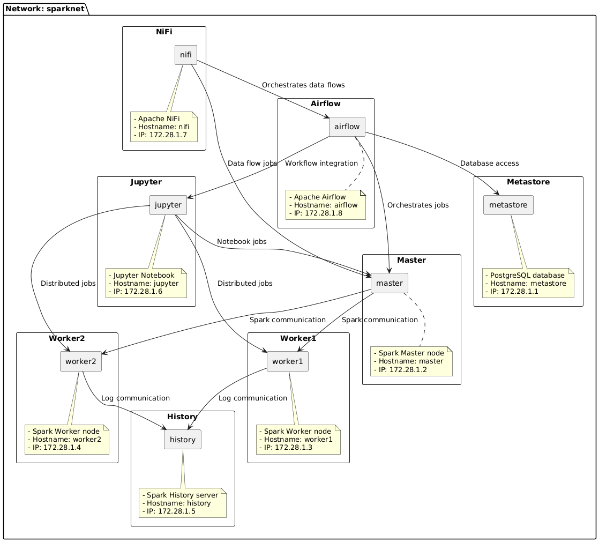
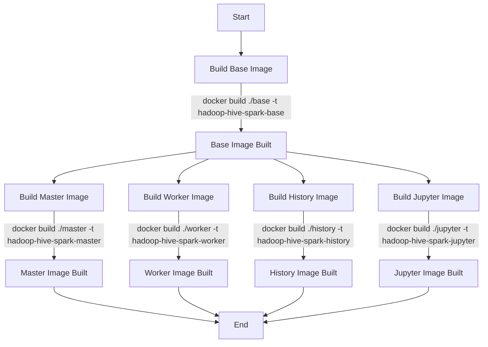

# Big Data Cluster Docker

## local cluster list

* [Apache Hadoop](https://hadoop.apache.org/):
  * For distributed processing of large data sets, urls:
    * ResourceManager cluster: http://localhost:8088/cluster
    * NameNode health: http://localhost:9870/dfshealth.html#tab-overview
    * Datanode1:        http://localhost:9864
    * Datanode2:        http://localhost:9865
    * HistoryServer:    http://localhost:19888
    * NodeManager1:     http://localhost:8042
    * NodeManager2:     http://localhost:8043
* [Apache Spark](https://spark.apache.org/):
  * For batch processing, urls:
    * master:           http://localhost:8080
    * spark worker1:          http://localhost:8081
    * worker2:          http://localhost:8082
    * history:          http://localhost:18080

* [Apache Airflow](https://airflow.apache.org/): 
  * For orchestration, url: http://localhost:8083/home

* [Apache Nifi](https://nifi.apache.org/):
  * For stream processing, url: https://localhost:8443/nifi/#/login

* [Apache Griffin](https://griffin.apache.org/):
  * For Big data Quality, url: http://localhost:38080/#/health

* [Jupyter Notebook](https://griffin.apache.org/):
  * for development, url: http://localhost:8888

## Architecture

## Quick Start
1. build docker images "any platform engineering project must have a build lifecycle", simple as follows:
    - Build the base image:     `docker build ./base -t hadoop-hive-spark-base`
    - Build the master image:   `docker build ./master -t hadoop-hive-spark-master`
    - Build the worker image:   `docker build ./worker -t hadoop-hive-spark-worker`
    - Build the history image:  `docker build ./history -t hadoop-hive-spark-history`
    - Build the jupyter image:  `docker build ./jupyter -t hadoop-hive-spark-jupyter`

2. deploy the cluster, run: `docker-compose up -d`