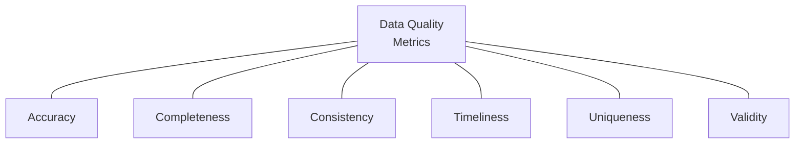
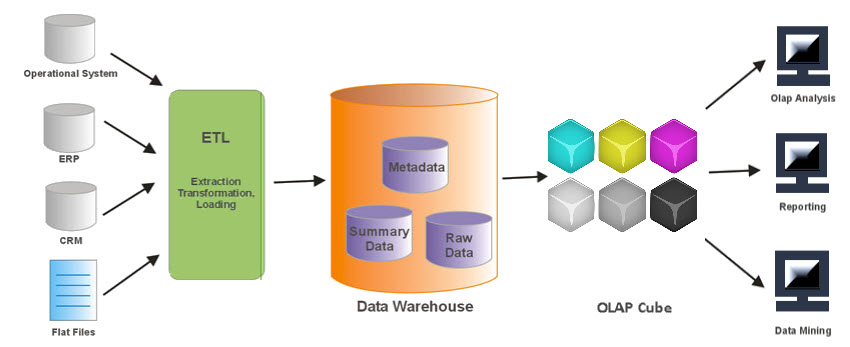
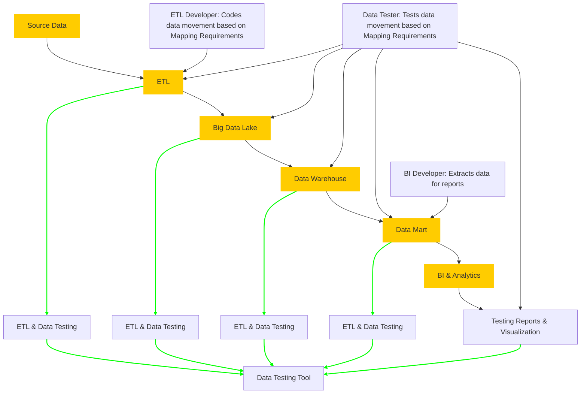

# Data Warehouse/ETL Testing​

Data quality is crucial for organizations aiming to make informed decisions, and understanding data quality dimensions is the first step in ensuring reliable and accurate data. 

## Data Quality metrics (Dimensions)

Data quality dimensions are specific characteristics used to assess and measure the overall quality of data within a dataset. They help identify areas where data may be lacking or inaccurate, ensuring that the information used for decision-making is trustworthy and valuable. Here are the key data quality dimensions:

1.  **Accuracy** The degree to which data accurately represents the real-world constructs or events it is supposed to model. Inaccurate data can result from errors during data entry, system issues, or outdated information. Regular validation and verification processes help maintain accuracy.
2.  **Completeness** Completeness measures the presence of all required data elements within a dataset, ensuring that no essential information is missing. Incomplete data can hinder analyses and decision-making. Data completeness checks involve ensuring that all necessary fields are populated for each record.
3.  **Consistency** Consistency assesses the uniformity of data across different datasets, databases, or systems, ensuring that there are no contradictions. Inconsistencies can arise from data integration issues or discrepancies in data recording practices. Data consistency checks aim to align information across the organization.
4.  **Timeliness** Timeliness measures how current and up-to-date the data is, ensuring that it remains relevant for its intended use. Outdated information can lead to incorrect analyses or decisions. Timeliness checks involve assessing whether data is regularly updated to reflect the latest changes.
5.  **Validity** Validity assesses whether data adheres to predefined rules, standards, or formats, ensuring that it meets the required criteria. Invalid data may result from input errors or deviations from established standards. Validation checks confirm that data conforms to the specified criteria.
6.  **Reliability** Reliability measures the trustworthiness of data sources and the consistency of the data, ensuring it is free from bias and error. Unreliable data sources can introduce inaccuracies. Reliability checks involve evaluating the credibility of data providers and assessing the consistency of data over time.
7.  **Precision** Precision refers to the level of detail or granularity present in numerical data. Precision ensures that numerical values are recorded with the appropriate level of detail, such as the correct number of decimal places. It is crucial for maintaining the accuracy of quantitative analyses.
8.  **Uniqueness** Uniqueness ensures that there are no duplicate records or instances within a dataset. Duplicate data can lead to overcounting or other errors in analysis. Uniqueness checks involve identifying and eliminating duplicate entries.
9.  **Relevance** Relevance assesses the applicability and usefulness of data for its intended purpose.Data that is not relevant to a particular analysis or decision-making process may introduce noise. Regularly evaluating the relevance of data helps maintain its usefulness.
10.  **Accessibility** Accessibility measures how easily authorized users can access and retrieve the required data.Difficulty in accessing data can hinder productivity. Accessibility checks ensure that data is stored in a manner that allows efficient retrieval by authorized personnel.

### Why Do Data Quality Dimensions Matter?

-   **Informed Decision-Making:** High-quality data ensures that decisions are based on accurate and reliable information.
-   **Trust and Credibility:** Reliable data builds trust among stakeholders, enhancing the credibility of reports and analyses.
-   **Operational Efficiency:** Clean and accurate data reduces errors, streamlining business processes and increasing efficiency.
-   **Regulatory Compliance:** Many industries have regulations regarding data accuracy and privacy, making adherence to data quality standards essential for compliance.

### Applying Data Quality Dimensions in Real World differs from one business to another

#### 1. E-commerce Platform:

-   **Accuracy**: Ensure that product descriptions and prices accurately reflect the actual offerings to avoid misleading customers.
-   **Completeness**: Require all product listings to include essential information such as images, specifications, and customer reviews.
-   **Consistency**: Maintain consistent product categorization and attributes across different sections of the platform to enhance user experience.
-   **Timeliness**: Update inventory levels in real-time to prevent the sale of out-of-stock items and ensure accurate stock information.

#### 2. Healthcare System:

-   **Validity**: Implement validation rules to ensure that medical diagnoses conform to recognized coding standards (e.g., ICD-10).
-   **Reliability**: Regularly audit and verify data sources, such as patient records, to ensure the trustworthiness of medical information.
-   **Uniqueness**: Use unique patient identifiers to avoid duplication of medical records and prevent errors in treatment.
-   **Relevance**: Tailor patient data collection to specific medical specialties, ensuring that only relevant information is recorded for each case.

#### 3. Financial Services:

-   **Precision**: Specify the number of decimal places for financial transactions to ensure accuracy in calculations and reporting.
-   **Completeness**: Require all financial transactions to include essential details such as transaction date, amount, and involved parties.
-   **Consistency**: Ensure that financial data is consistent across different reports, preventing discrepancies in balance sheets and financial statements.
-   **Timeliness**: Implement processes to update interest rates and market values promptly for accurate investment portfolio assessments.

#### 4. Human Resources Management:

-   **Uniqueness**: Use unique employee IDs to avoid duplication in the HR database and ensure accurate tracking of personnel.
-   **Accuracy**: Regularly update employee records with accurate information such as job titles, roles, and department assignments.
-   **Accessibility**: Ensure that authorized personnel have easy access to employee data for tasks like payroll processing and performance reviews.
-   **Consistency**: Align job titles and salary scales across different HR systems to maintain consistency in reporting.

#### 5. Marketing and Customer Relationship Management (CRM):

-   **Validity**: Implement validation rules for customer data, ensuring that email addresses, phone numbers, and other contact details are in the correct format.
-   **Relevance**: Regularly review and update customer preferences to ensure that marketing campaigns are tailored to individual interests.
-   **Completeness**: Ensure that customer profiles are complete with relevant information, allowing for personalized communication.
-   **Timeliness**: Regularly update customer interaction data to ensure that marketing strategies are based on recent customer behavior.

### Best Practices for Managing Data Quality Dimensions:

**1. Establish Data Quality Standards:** Define clear standards for each data quality dimension based on your organization's specific needs and industry requirements.

**2. Document Data Processes:** Document the processes involved in data collection, entry, and maintenance to identify potential points of error and ensure consistency.

**3. Implement Data Validation Rules:** Integrate validation rules into data entry systems to catch errors in real-time, reducing the likelihood of inaccurate or incomplete data.

**4. Regularly Monitor Data Quality:** Set up routine monitoring processes to regularly assess data quality dimensions, identifying and addressing issues promptly.

**5. Involve Stakeholders:** Engage with stakeholders, including data users and contributors, to gain a holistic understanding of data quality requirements and challenges.

**6. Use Data Quality Tools:** Explore and leverage data quality tools and software that automate the identification and correction of data quality issues.

**7. Conduct Data Audits:** Periodically conduct data audits to review the overall quality of your datasets, addressing any emerging patterns of inconsistency or inaccuracy.

**8. Invest in Employee Training:** Provide training to employees involved in data-related tasks to enhance their awareness of data quality dimensions and best practices.

### Realizing the Impact of Data Quality

**1. Improved Customer Satisfaction:** Accurate and complete customer data leads to better customer interactions and increased satisfaction.

**2. Efficient Marketing Campaigns:** Relevant and precise data enables targeted marketing efforts, improving campaign effectiveness and return on investment.

**3. Confident Decision-Making:** Reliable data instills confidence in decision-makers, supporting strategic planning and informed business decisions.

**4. Regulatory Compliance:** Adherence to data quality standards helps organizations meet regulatory requirements, avoiding legal and financial consequences.

## Understanding the ETL Testing Process

A solid understanding of data modeling provides testing teams with information to develop the right testing strategy. During the analysis phase, the testing team must learn and understand the different stages of the data warehouse implementation including but not limited to:

-   Source data profiling
    
-   Data warehouse design
    
-   ETL development
    
-   Data loading and transformations
    

ETL testing includes multiple phases, and testing should be executed throughout the lifecycle of the data warehouse implementation, not just at the end.

## Preparing for ETL Testing

A data warehouse implementation must include end-to-end testing. The QA team must test initial and incremental loads for the entire ETL process beginning with identifying source data to report and portal functions. They must also test each point between extract and load, including data load from the source extract to staging, staging to transformation and once the data reaches the data warehouse, test data extraction for display and reporting.

With traditional ETL test planning, there are six phases:

1.  Understanding business requirements/analysis
    
2.  Creating test plans and estimating time to completion
    
3.  Designing test cases and selecting test data
    
4.  Executing tests with bug reporting and closure
    
5.  Report summary and analysis
    
6.  Test completion
    

ETL testing is performed in five stages:

1.  Identifying data sources and requirements
    
2.  Data acquisition
    
3.  Implement business logic and Dimensional Modeling
    
4.  Build and populate data
    
5.  Build Reports
    

### Test Planning Process

<table><tbody><tr><td>Identify Data Sources</td><td>Data Acquisition</td><td>Implement business logic and Dimensional Modeling</td><td>Build and populate analytical cube</td><td>Build reports</td></tr><tr><td>Requirement/Analysis</td><td>Design and Coding</td><td>Design and Coding</td><td>Design and Coding</td><td>QA and Deployment</td></tr></tbody></table>

### Test Execution Process

<table><tbody><tr><td>Validating required data /data sources:</td><td>Review metadata/data dictionary</td><td>Review archival/purge strategy</td><td>Test data prep</td></tr><tr><td>Data profiling:</td><td>Validate source to target mapping</td><td>Error logging, exception handling, recoverability</td><td>ETL testing (end to end)</td></tr><tr><td>Data quality and performance acceptance criteria:</td><td>Validate ETL/Data Warehouse architecture</td><td>Parallel Execution and Precedence</td><td>OLAP and cube testing</td></tr><tr><td>Data transformation rules:</td><td>Validate data model – Dimensional modeling and normalized approach</td><td>ETL pull logic – full/incremental</td><td>Report testing – drill down/drill through</td></tr></tbody></table>

## Common ETL Testing Types

Organizations use data warehouse testing to ensure that required business functions are implemented correctly. This phase includes data verification, which tests the quality of data populated into target tables. The table below describes the most common testing types.

| Test | Description |
| --- | --- |
| Metadata Testing | Metadata testing confirms that the table definitions conform to the data model and application design specifications. This test should include data type check, data length check, and index/constraint check. |
| Data Completeness Testing | Data Completeness testing validates that all the expected source data has been successfully loaded to the target. Tests include: Compare and Validate counts, aggregates (min, max, sum, avg), and actual data between the source and destination. |
| Data Quality Testing | Data Quality tests validate the accuracy of the data. Data profiling is used to identify data quality issues, and the ETL is designed to fix or handle these issue. Automating the data quality checks between the source and target system can help to mitigate problems post-implementation. |
| Data Transformation Testing | Data Transformation comes in two flavors: white box testing and black box testing. White box data transformation testing examines the program structure and develops test data from the program logic/code. Testers review the transformation logic from the mapping design document and the ETL code to create test cases. Black-box testing examines the functionality of an application without looking at internal structures for transformation testing; this involves reviewing the transformation logic from the mapping design document creating the appropriate test data. |
| ETL Regression Testing | ETL Regression testing validates that the ETL produces the same output for a specific input before and after the change. |
| Incremental ETL Testing | Incremental ETL testing verifies that updates on the sources are getting loaded into the target system correctly. |
| ETL Integration Testing | ETL integration testing is end-to-end testing of the data in the ETL process and the target application. |
| ETL Performance Testing | ETL performance testing is end-to-end testing to ensure that the all steps in the ETL process are working with expected data volumes. One pitfall of this testing method is the lack of actual data to emulate appropriate volumes. |

Testing mission-critical data warehouse infrastructure is required. Testing is an essential part of building a new data warehouse (or consolidating several), and it must be part of the development pipeline when the ETL process is modified or extended.

Testing data and systems systematically for inconsistencies before moving into production is necessary if the data warehouse is to be the central source of business information. Whether it is a newly built data warehouse or the consolidation of several, you must develop a thorough data warehouse testing process to help you test for, resolve, and prevent unnecessary exposure.

### where testing happens:

