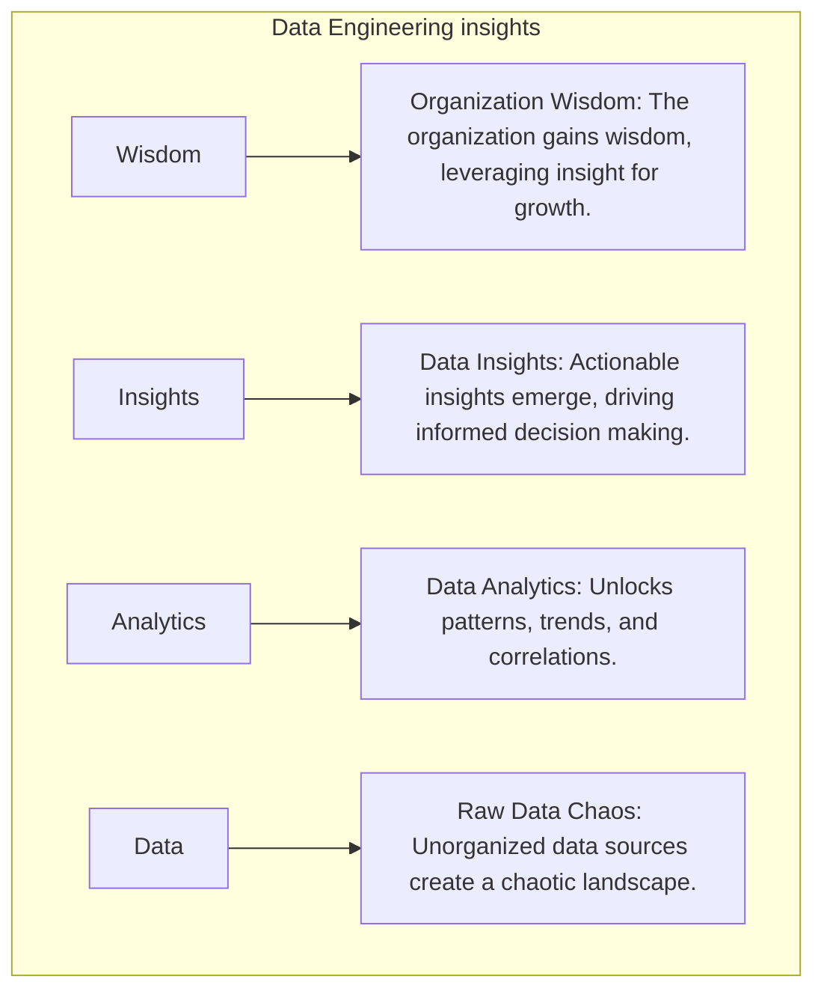
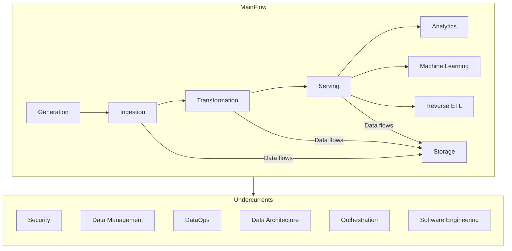
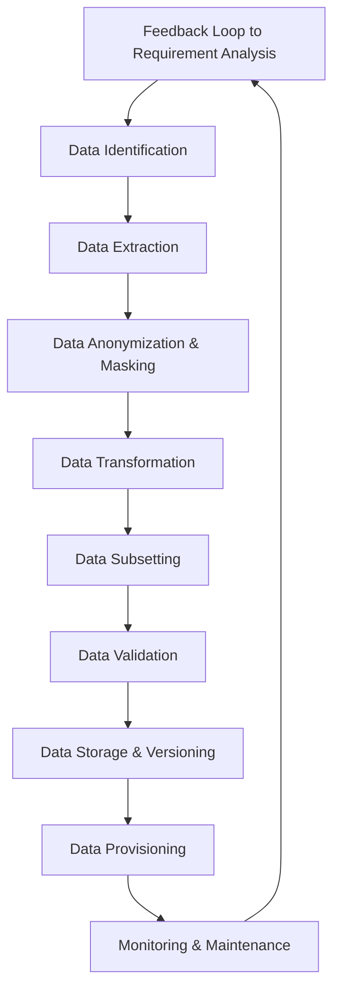

# Fundamentals of data engineering

source of this data is a summery of "[**Fundamentals of Data Engineering**](https://www.oreilly.com/library/view/fundamentals-of-data/9781098108298/)" 

In today's data-driven environment, businesses continuously face the challenge of harnessing and interpreting vast amounts of information. Data engineering is a crucial intersection of technology and business intelligence and plays a critical role in everything from data science to machine learning and artificial intelligence.

So, what makes data engineering indispensable? In a nutshell: its ability to convert raw data into actionable insights.

With the explosion of data sources – from website interactions, transactions, and social media engagements to sensor readings – businesses are generating data at an unparalleled rate. Data engineering equips us with the tools and methodologies needed to gather, process, and structure the data, ensuring it is ready for analysis and decision-making.

This fundamentals of data engineering guide offers a broad overview, preparing readers for a more detailed exploration of data engineering principles.

## Summary of fundamentals of data engineering

| Concept | Description |
| --- | --- |
| Data engineering | The discipline focuses on preparing “big data” for analytical or operational uses. |
| Use cases | Practical scenarios where data engineering plays a pivotal role, such as e-commerce analytics or real-time monitoring. |
| Data engineering lifecycle | The stages, from data ingestion to analytics, encompass integration, transformation, warehousing, and maintenance. |
| Data pipelines | A visual flow of the entire data engineering process, highlighting how data moves through each stage. |
| Batch vs. stream processing | Distinguishing between processing data in large sets (batches) versus real-time (stream) processing. |
| Data engineering best practices | Established methods and strategies in data engineering to ensure data integrity, efficiency, and security. |
| Data engineering vs. artificial intelligence | Differentiating the process of preparing data for AI applications from using AI to enhance data engineering tasks. |

## What is data engineering?

Data engineering is the process of designing, building, and maintaining systems within a business that enable the deriving of meaningful insights from operational data. In an era where data is frequently likened to oil or gold, data engineering emerges as the refining process that refines the raw data into a potent fuel for innovation and strategy.

Data engineering uses various tools, techniques, and best practices to achieve end goals. Data is collected from diverse sources like human-generated forms, human and system-generated content like documents, images, videos, transaction logs, IoT systems, geolocation data and tracking, application logs, and events. It results in data that fits into three broad categories.

-   Structured data organized in databases with a clear schema, often in tabular formats like SQL databases.
-   Unstructured data like images, videos, emails, and text documents that cannot fit into schemas.
-   Semi-structured data that includes both structured and unstructured elements.

Each dataset and its use case for analysis requires a different strategy. For example, some data types are processed infrequently in batches, while others are processed continuously as soon as they are generated. Sometimes, data integration is done from several sources, and all data is stored centrally for analytics. At other times, subsets of data are pulled from different sources and prepared for analytics.

Tools and frameworks like Apache Hadoop, Apache Spark™, Apache Kafka®, Airflow, Redpanda, Apache Beam®, Apache Flink®, and more exist to implement the different data engineering approaches. The diverse landscape of tools ensures flexibility, scalability, and performance, regardless of the nature or volume of data.

### Data engineering use cases

Data engineering is required in almost all aspects of modern-day computing.

#### Real-time analytics

Real-time analytics offer valuable information for businesses requiring immediate insights that can drive rapid decision-making processes. It is indispensable in everything from monitoring customer engagement to tracking supply chain efficiency.

#### Customer 360

Data engineering enables businesses to develop comprehensive customer profiles by collating data from multiple touchpoints. This can include purchase history, online interactions, and social media engagement, helping to offer more personalized experiences.

#### Fraud detection

Financial, gaming, and similar applications rely on complex algorithms to detect abnormal patterns and potentially fraudulent activities. Data engineering provides the structure and pipelines to analyze vast amounts of transaction data, often in near real-time.

#### Health monitoring systems

In healthcare, data engineering is vital in developing systems that can aggregate and analyze patient data from various sources, such as wearable devices, electronic health records, and even genomic data for more accurate diagnoses and treatment plans.

#### Data migration

Transitioning data between systems, formats, or storage architectures is complex. Data engineering provides tools and methodologies to ensure smooth, lossless data migration, enabling businesses to evolve their infrastructure without data disruption.

#### Artificial intelligence

The era of digitization has ushered in an exponential surge in data generation. Businesses looking to harness the power of this data are increasingly turning to artificial intelligence (AI) and machine learning (ML) technologies. However, the success of AI and ML hinges predominantly on the quality and structure of data the system receives.

This has inherently magnified the importance and complexity of data engineering. AI models require timely and consistent data feeds to function optimally. Data engineering establishes the pipelines feeding these algorithms, ensuring that AI/ML models train on high-quality datasets for optimal performance.

## The data engineering lifecycle

The data engineering lifecycle is one of the key fundamentals of data engineering. It focuses on the stages a data engineer controls. Undercurrents are key principles or methodologies that overlap across the stages.

### Stages of the cycle

**Data ingestion** incorporates data from generating sources into the processing system. For instance, in the push model, data from the source system gets written to the desired destination, while in the pull model, it is the other way around. The line separating push and pull methodologies blurs as data transits through numerous stages in a pipeline. Nevertheless, mastering data ingestion is paramount to ensuring the seamless flow and preparation of data for subsequent analytical stages.

**Data transformation** refines raw data through operations that enhance its quality and utility. For example, it normalizes values to a standard scale, fills gaps where data might be missing, converts between data types, or adds even more complex operations to extract specific data features. The goal is to mold the data into a structured, standardized format primed for analytical operations.

**Data serving** makes processed and transformed data available for end-users, applications, or downstream processes. It delivers data in a structured and accessible manner, often through APIs. It ensures that data is timely, reliable, and accessible to support various analytical, reporting, and operational needs of an organization.

**Data storage** is the underlying technology that stores data through the various data engineering stages. It bridges diverse and often isolated data sources—each with its own fragmented data sets, structure, and format. Storage merges the disparate sets to offer a cohesive and consistent data view. The goal is to ensure data is reliable, available, and secure.

### Key considerations

#### Security

Data engineers prioritize security at every stage so that data is accessible only to authorized users. They adhere to the principle of least privilege as a best practice, so users only access what is necessary for their work and for the required duration only. Data is often encrypted as it moves through the stages and in storage.

#### Data management

Data management provides frameworks that incorporate a broader perspective of data utility across the organization. It encompasses various facets like data governance, modeling, lineage, and meeting ethical and privacy considerations. The goal is to align data engineering processes with an organization's broader legal, financial, and cultural policies.

#### DataOps

DataOps applies principles from Agile, DevOps, and statistical process control to enhance data product quality and release efficiency. It combines people, processes, and technology for improved collaboration and rapid innovation. It fosters transparency, efficiency, and cost control at every stage.

#### Data architecture

Data architecture supports an organization’s long-term business goals and strategy. This involves knowing the trade-offs and making informed choices about design patterns, technologies, and tools that balance cost and innovation.

#### Software engineering

While data engineering has become more abstract and tool-driven, data engineers still need to write core data processing code proficiently in different frameworks and languages. They must also employ proper code-testing methodologies and may need to solve custom coding problems beyond their chosen tools, especially when managing infrastructure in cloud environments through Infrastructure as Code (IaC) frameworks.

Redpanda: a powerful Kafka alternative

Fully Kafka API compatible. 6x faster. 100% easier to use.

[Learn More](https://redpanda.com/what-is-redpanda)

## Data engineering best practices

Navigating the data engineering world demands precision and a deep understanding of best practices. Low-quality data leads to skewed analytics, resulting in poor business decisions.

Best practice

Importance

Proactive data monitoring

Regularly checks datasets for anomalies to maintain data integrity. This includes identifying missing, duplicate, or inconsistent data entries.

Schema drift management

Detects and addresses changes in data structure, ensuring compatibility and reducing data pipeline breaks.

Continuous documentation

Manages descriptive information about data, aiding in discoverability and comprehension.

Data security measures

Controls and monitors access to data sources, enhancing security and compliance.

Version control and backups

Tracks change to datasets over time, aiding in reproducibility and audit trails.

### Proactive data monitoring

Monitoring data quality should be an ongoing, active process, not a passive one. Regularly checking datasets for anomalies ensures that issues like missing or duplicate data are identified swiftly. Implementing automated data quality checks during data ingestion and transformation is crucial. Leveraging tools that notify of discrepancies allows for immediate intervention and corrections.

A tool like Apache Griffin can be used to measure data quality across platforms in real-time, providing visibility into data health. Data engineers also perform rigorous validation checks at every data ingestion point, leveraging frameworks like Apache Beam® or Deequ. An example in practice is e-commerce platforms ensuring valid email formats and appropriate phone number entries.

    # Using Python's built-in methods for simple validation
    def is_valid_email(email):
        return "@" in email and "." in email
    # Simple Pytest for data validation
    def test_data_entry(entry):
        assert type(entry['price']) == float, "Price should be a float"

### Schema drift management

Schema drift—unexpected changes in data structure—can disrupt data pipelines or lead to incorrect data analysis. It can result from scenarios like an API update altering data fields. To handle schema drift, data engineers can:

-   Utilize dynamic schema solutions that adjust to data changes in real time.
-   Perform regular audits and validate data sources.
-   Integrate version controls for schemas, maintaining a historical record.

In a Python-based workflow using Pandas, detecting schema drift looks like the one below.

    import pandas as pd
    
    def detect_schema_drift(old_schema, new_schema):
        if set(old_schema) != set(new_schema):
            added = set(new_schema) - set(old_schema)
            removed = set(old_schema) - set(new_schema)
            return {"added": list(added), "removed": list(removed)}
        else:
            return None
    
    old_df = pd.DataFrame({
        'A': [1,2,3],
        'B': [4,5,6]
    })
    
    new_df = pd.DataFrame({
        'A': [1,2,3],
        'C': [7,8,9]
    })
    
    drift = detect_schema_drift(old_df.columns, new_df.columns)
    print(drift)

### Continuous documentation

Maintaining up-to-date documentation becomes vital with the increasing complexity of data architectures and workflows. It ensures transparency, reduces onboarding times, and aids in troubleshooting. When multiple departments intersect, such as engineers processing data for a marketing team, a well-documented process ensures trust and clarity in data interpretation for all stakeholders.

Data engineers use platforms like Confluence or GitHub Wiki to ensure comprehensive documentation for all pipelines and architectures. Making documentation a mandatory step in your data pipeline development process is one of the key fundamentals of data engineering. Use tools that allow for automated documentation updates when changes in processes or schemas occur.

### Data security measures

As data sources grow in number and variety, ensuring the right people have the right access becomes crucial for both data security and efficiency. Understanding a data piece's origin and journey is critical for maintaining transparency and aiding in debugging.

Tools like Apache Atlas offer insights into data lineage—a necessity in sectors where compliance demands tracing data back to its origin. Systems like Apache Kafka® append changes as new records, a practice especially crucial in sectors like banking. Automated testing frameworks like Pytest and monitoring tools like Grafana all contribute to proactive data security.

Some security best practices include:

-   Implement a federated access management system that centralizes data access controls.
-   Regularly review and update permissions to reflect personnel changes and evolving data usage requirements.
-   Avoid direct data edits that can corrupt data.

In a world of increasing cyber threats, data breaches like the Marriott incident of 2018 underscore the importance of encrypting sensitive data and frequent access audits to comply with regulations like GDPR.

### Version control and backups

As with software development, version control in data engineering allows for tracking changes, reverting to previous states, and ensuring smooth collaboration among data engineering teams. Integrate version control systems like Git into your data engineering workflow. Regularly back up not just data but also transformation logic, configurations, and schemas.

Incorporating these best practices into daily operations bolsters data reliability and security—it elevates the value that data engineering brings to an organization. Adopting and refining these practices will position you at the forefront of the discipline, paving the way for innovative approaches and solutions in the field.

## Emerging trends & challenges

As data sources multiply, the process of ingesting, processing, and transforming data becomes cumbersome. Systems must scale to avoid becoming bottlenecks. **Automation tools** are stepping in to streamline data engineering processes, ensuring data pipelines remain robust and efficient. Data engineers are increasingly adopting distributed data storage and processing systems like Hadoop or Spark. Netflix's adoption of a microservices architecture to manage increasing data is a testament to the importance of scalable designs.

The shift towards **cloud-based storage and processing** solutions has also revolutionized data engineering. Platforms like AWS, Google Cloud, and Azure offer scalable storage and high-performance computing capabilities. These platforms support the vast computational demands of data engineering algorithms and ensure data is available and consistent across global architectures.

AI's rise has paralleled the evolution of data-driven decision-making in businesses. Advanced algorithms can sift through vast datasets, identify patterns, and offer previously inscrutable insights. However, these insights are only as good as the data they're based on. The fundamentals of data engineering are evolving with AI.

### Using data engineering in AI

AI applications process large amounts of visual data. For example, optical character recognition converts typed or handwritten text images into machine-encoded text. Computer vision applications train machines to interpret and understand visual data. Images and videos from different sources, resolutions, and formats need harmonization. The input images must be of sufficient quality, and data engineers often need to preprocess these images to enhance clarity. Many computer vision tasks require labeled data, demanding efficient tools for annotating vast amounts of visual data.

AI applications can also learn and process human language. For instance, they can identify hidden sentiments in content, summarize and sort documents, and translate from one language to another. These AI applications require data engineers to convert text into numerical vectors using embeddings. The resulting vectors can be extensive, demanding efficient storage solutions. Real-time applications require rapid conversion into these embeddings, challenging data infrastructure's processing speed. Data pipelines have to maintain the context of textual data. It also involves data infrastructure capable of handling varied linguistic structures and scripts.

Large language models(LLMs)like OpenAI's GPT series are pushing the boundaries of what's possible in natural language understanding and generation. These models, trained on extensive and diverse text corpora, require:

-   **Scale—**The sheer size of these models necessitates data storage and processing capabilities at a massive scale.
-   **Diversity—**To ensure the models understand the varied nuances of languages, data sources need to span numerous domains, languages, and contexts.
-   **Quality—**Incorrect or biased data can lead LLMs to produce misleading or inappropriate outputs.

### Using AI for data engineering

The relationship between AI and data engineering is bidirectional. While AI depends on data engineering for quality inputs, data engineers also employ AI tools to refine and enhance their processes. The inter-dependency underscores the profound transformation businesses are undergoing. As AI continues to permeate various sectors, data engineering expectations also evolve, necessitating a continuous adaptation of skills, tools, and methodologies.

Using AI for data engineering

Here's a deeper dive into how AI is transforming the fundamentals of data engineering:

#### Automated data cleansing

AI models can learn the patterns and structures of clean data. They can automatically identify and correct anomalies or errors by comparing incoming data to known structures. This ensures that businesses operate with clean, reliable data without manual intervention, thereby increasing efficiency and reducing the risk of human error.

#### Predictive data storage

AI algorithms analyze the growth rate and usage patterns of stored data. By doing so, they can predict future storage requirements. This foresight allows organizations to make informed decisions about storage infrastructure investments, avoiding overprovisioning and potential storage shortages.

#### Anomaly detection

Machine learning models can be trained to recognize "normal" behavior within datasets. When data deviates from this norm, it's flagged as anomalous. Early detection of anomalies can warn businesses of potential system failures, security breaches, or even changing market trends. (**Tip:** check out this tutorial on [**how to build a real-time anomaly detection using Redpanda and Bytewax**](https://redpanda.com/blog/air-quality-monitoring-application-redpanda-bytewax).)

#### Imputation

Along with detecting anomalies, AI can also help with discovering and completing missing data points in a given dataset. Machine learning models can predict and fill in missing data based on patterns and relationships in previously known data. For instance, if a dataset of weather statistics had occasional missing values for temperature, an ML model could use other related parameters like humidity, pressure, and historical temperature data to estimate the missing value.

#### Data categorization and tagging

NLP models can automatically categorize and tag unstructured data like text, ensuring it's stored appropriately and is easily retrievable. This automates and refines data organization, allowing businesses to derive insights faster and more accurately.

#### Optimizing data pipelines

AI algorithms can analyze data flow through various pipelines, identifying bottlenecks or inefficiencies. By [**optimizing the pipelines**](https://go.redpanda.com/data-streaming-for-ai-in-the-financial-services-industry), businesses can ensure faster data processing and lower computational costs.

#### Semantic data search

Rather than relying on exact keyword matches, AI-driven semantic searches understand the context and intent behind search queries, allowing users to find data based on its meaning. This provides a more intuitive and comprehensive data search experience, especially in vast data lakes.

#### Data lineage tracking

AI models can trace the journey of data from its source to its final destination, detailing all transformations along the way. This ensures transparency, aids in debugging, and ensures regulatory compliance.

In essence, the integration of AI into data engineering is a game-changer. As AI simplifies and enhances complex data engineering tasks, professionals can focus on strategic activities, pushing the boundaries of what's possible in data-driven innovation. The potential of this synergy is vast, promising unprecedented advancements in data efficiency, accuracy, and utility.

Have questions about Kafka or streaming data?

Join a global community and chat with the experts on Slack.
