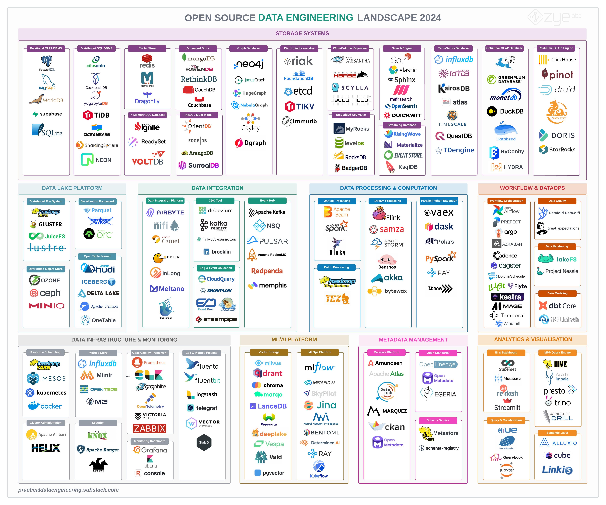

Data engineering involves a complex set of tasks that include moving data from various sources, processing it, and loading it into systems where it can be analyzed. To efficiently handle these tasks, data engineers use a variety of specialized tools and frameworks. This blog post explores the essential tools, the intricate ecosystem, and the integration platforms vital to data engineering.

## Table of contents
- Storage Systems
- Data Lake Platform
- Data Integration
- Data Processing & Computation
- Workflow Management & DataOps
- Data Infrastructure
- Metadata Management
- Analytics & Visualisation
- ML/AI Platform

## STORAGE SYSTEMS
At the core of data engineering are databases where all data handling processes begin and end. These can be:

SQL Databases: Like MySQL and PostgreSQL, used for structured data and integral to applications needing reliable transaction management.
NoSQL Databases: Such as MongoDB, suited for unstructured data and providing flexibility in terms of data models and scalability.

### Relational DBMS
- [PostgreSQL](https://github.com/postgres/postgres) - Advanced object-relational database management system
- [MySQL](https://github.com/mysql/mysql-server) - One of the most popular open Source Databases
- [MariaDB](https://github.com/MariaDB/server) - A popular MySQL server fork
- [Supabase](https://github.com/supabase/supabase) - An open source Firebase alternative
- [SQlite](https://github.com/sqlite/sqlite) - Most popular embedded database engine

### Distributed SQL DBMS
- [Citus](https://github.com/citusdata/citus) - A popular distributed PostgreSQL as an extension
- [CockroachDB](https://github.com/cockroachdb/cockroach) - A cloud-native distributed SQL database
- [YugabyteDB](https://github.com/yugabyte/yugabyte-db) - A cloud-native distributed SQL database
- [TiDB](https://github.com/pingcap/tidb) - A cloud-native, distributed, MySQL-Compatible database
- [OceanBase](https://github.com/oceanbase/oceanbase) - A scalable distributed relational database
- [ShardingSphere](https://github.com/apache/shardingsphere) - A Distributed SQL transaction & query engine
- [Neon](https://github.com/neondatabase/neon) - A serverless open-source alternative to AWS Aurora Postgres
- [CrateDB](https://github.com/crate/crate) - A distributed and scalable PostgreSQL-compatible SQL database

### Cache Store
- [Redis](https://github.com/redis/redis) - A popular key-value based cache store
- [Memcached](https://github.com/memcached/memcached) - A high performance multithreadedkey-value cache store
- [Dragonfly](https://github.com/dragonflydb/dragonfly) - A modern cache store compatible with Redis and Memcached APIs

### In-memory SQL Database
- [Apache Ignite](https://github.com/apache/ignite) - A distributed, ACID-compliant in-memory DBMS 
- [ReadySet](https://github.com/readysettech/readyset) - A MySQL and Postgres wire-compatible caching layer
- [VoltDB](https://github.com/voltdb/voltdb/) - A distributed, horizontally-scalable, ACID-compliant database 

### Document Store
- [MongoDB](https://github.com/mongodb/mongo) - A cross-platform, document-oriented NoSQL database
- [RavenDB](https://github.com/ravendb/ravendb) - An ACID NoSQL document database
- [RethinkDB](https://github.com/rethinkdb/rethinkdb) - A distributed document-oriented database for real-time applications
- [CouchDB](https://github.com/apache/couchdb) - A Scalable document-oriented NoSQL database
- [Couchbase](https://github.com/couchbase) - A modern cloud-native NoSQL distributed database
- [FerretDB](https://github.com/FerretDB/FerretDB) - A truly Open Source MongoDB alternative!
- [LowDB](https://github.com/typicode/lowdb) - A simple and fast JSON database 

### NoSQL Multi-model
- [OrientDB](https://github.com/orientechnologies/orientdb) - A Multi-model DBMS supporting Graph, Document, Reactive, Full-Text and Geospatial models
- [ArrangoDB](https://github.com/arangodb/arangodb) - A  Multi-model database with flexible data models for documents, graphs, and key-values
- [SurrealDB](https://github.com/surrealdb/surrealdb) - A scalable, distributed, collaborative, document-graph database
- [EdgeDB](https://github.com/edgedb/edgedb) - A graph-relational database with declarative schema

### Graph Database
- [Neo4j](https://github.com/neo4j/neo4j) - A high performance leading graph database
- [JunasGraph](https://github.com/JanusGraph/janusgraph) - A highly scalable distributed graph database
- [HugeGraph](https://github.com/apache/incubator-hugegraph) - A fast-speed and highly-scalable graph database
- [NebulaGraph](https://github.com/vesoft-inc/nebula) - A distributed, horizontal scalability, fast open-source graph database
- [Cayley](https://github.com/cayleygraph/cayley) - Inspired by the graph database behind Google's Knowledge Graph
- [Dgraph](https://github.com/dgraph-io/dgraph) -  A horizontally scalable and distributed GraphQL database with a graph backend

### Distributed Key-value Store
- [Riak](https://github.com/basho/riak) - A decentralized key-value datastore from Basho Technologies
- [FoundationDB](https://github.com/apple/foundationdb) - A distributed, transactional key-value store from Apple
- [etcd](https://github.com/etcd-io/etcd) - A distributed reliable key-value store written in Go
- [TiKV](https://github.com/tikv/tikv) - A distributed transactional key-value database, originally created to complement TiDB
- [Immudb](https://github.com/codenotary/immudb) - A database with built-in cryptographic proof and verification
- [Valkey](https://github.com/valkey-io/valkey) - A distributed key-value datastore forked from Redis

### Wide-column Key-value Store
- [Apache Cassandra](https://github.com/apache/cassandra) - A highly-scalable LSM-Tree based partitioned row store
- [Apache Hbase](https://github.com/apache/hbase) - A distributed wide column-oriented store modeled after Google' Bigtable
- [Scylla](https://github.com/scylladb/scylladb) - LSM-Tree based wide-column API-compatible with Apache Cassandra and Amazon DynamoDB
- [Apache Accumulo]() - A distributed key-value store with scalable data storage and retrieval, on top of Hadoop

### Embedded Key-value Store
- [LevelDB](https://github.com/google/leveldb) - A fast key-value storage library written at Google
- [RocksDB](https://github.com/facebook/rocksdb) - An embeddable, persistent key-value store developed by Meta (Facebook)
- [MyRocks](https://github.com/facebook/mysql-5.6) - A RocksDB storage engine for MySQL
- [BadgerDB](https://github.com/dgraph-io/badger) - An embeddable, fast key-value database written in pure Go

### Search Engine
- [Apache Solr](https://github.com/apache/solr) - A fast distributed search database built on Apache Lucene
- [Elastic Search](https://github.com/elastic/elasticsearch) - A distributed, RESTful search engine optimized for speed
- [Sphinx](https://github.com/sphinxsearch/sphinx) -  A fulltext search engine with high speed of indexation
- [Meilisearch](https://github.com/meilisearch/meilisearch) - A fast search API with great integration support
- [OpenSearch](https://github.com/opensearch-project/OpenSearch) - A community-driven, open source fork of Elasticsearch and Kibana
- [Quickwit](https://github.com/quickwit-oss/quickwit) - A fast cloud-native search engine for observability data
- [ParadeDB](https://github.com/paradedb/paradedb) - A search engine built on Postgres

### Streaming Database
- [RisingWave](https://github.com/risingwavelabs/risingwave) - A scalable Postgres for stream processing, analytics, and management
- [Materialize](https://github.com/MaterializeInc/materialize) - A real-time data warehouse purpose-built for operational workloads
- [EventStoreDB](https://github.com/EventStore/EventStore) - An event-native database designed for event sourcing and event-driven architectures
- [KsqlDB](https://github.com/confluentinc/ksql) - A database for building stream processing applications on top of Apache Kafka
- [Timeplus Proton](https://github.com/timeplus-io/proton) - A streaming SQL engine, fast and lightweight, powered by ClickHouse

### Time-Series Database
- [Influxdb](https://github.com/influxdata/influxdb) - A scalable datastore for metrics, events, and real-time analytics
- [TimeScaleDB](https://github.com/timescale/timescaledb) - A fast ingest time-series SQL database packaged as a PostgreSQL extension
- [Apache IoTDB](https://github.com/apache/iotdb) - An Internet of Things database with seamless integration with the Hadoop and Spark ecology
- [Netflix Atlas](https://github.com/Netflix/atlas) - An n-memory dimensional time series database developed and open sourced by Netflix
- [QuestDB](https://github.com/questdb/questdb) - A time-series database for fast ingest and SQL queries
- [TDEngine](https://github.com/taosdata/TDengine) - A high-performance, cloud native time-series database optimized for Internet of Things (IoT)
- [KairosDB](https://github.com/kairosdb/kairosdb) - A scalable time series database written in Java
- [GreptimeDB](https://github.com/GreptimeTeam/greptimedb) - A cloud-native, unified time series database for metrics, logs and events

### Columnar OLAP Database
- [Apache Kudu](https://github.com/apache/kudu) -  A column-oriented data store for the Apache Hadoop ecosystem
- [Greeenplum](https://github.com/greenplum-db/gpdb) -  A column-oriented massively parallel PostgreSQL for analytics
- [MonetDB](https://github.com/MonetDB/MonetDB) - A high-performance columnar database originally developed by the CWI database research group
- [Databend](https://github.com/datafuselabs/databend) - An lastic, workload-aware cloud-native data warehouse built in Rust
- [ByConity](https://github.com/ByConity/ByConity) - A cloud-native data warehouse forked from ClickHouse
- [hydra](https://github.com/hydradatabase/hydra) - A fast column-oriented Postgres extension

### Real-time OLAP Engine
- [ClickHouse](https://github.com/ClickHouse/ClickHouse) - A real-time column-oriented database originally developed at Yandex
- [Apache Pinot](https://github.com/apache/pinot) - A a real-time distributed OLAP datastore open sourced by LinkedIn
- [Apache Druid](https://github.com/apache/druid) - A high performance real-time OLAP engine developed and open sourced by Metamarkets
- [Apache Kylin](https://github.com/apache/kylin) - A distributed OLAP engine designed to provide multi-dimensional analysis on Hadoop
- [Apache Doris](https://github.com/apache/doris) - A high-performance and real-time analytical database based on MPP architecture
- [StarRocks](https://github.com/StarRocks/StarRocks) -  A sub-second OLAP database supporting multi-dimensional analytics (Linux Foundation project)

### In-process OLAP Engine
- [DuckDB](https://github.com/duckdb/duckdb) - An in-process SQL OLAP Database Management System
- [GlareDB](https://github.com/GlareDB/glaredb) - A SQL database for running analytics across distributed data
- [Apache DataFusion](https://github.com/apache/datafusion) - An extensible query engine with SQL and Dataframe APIs
- [chdb](https://github.com/chdb-io/chdb) - An in-process OLAP SQL Engine powered by ClickHouse

### OLAP Extensions
- [pg_duckdb](https://github.com/duckdb/pg_duckdb) - A Postgres extension that embeds DuckDB's analytics engine
- [pg_analytics](https://github.com/paradedb/pg_analytics) - A DuckDB-powered analytics extension for Postgres

## DATA LAKE PLATFORM

### Distributed File System
- [Apache Hadoop HDFS](https://github.com/apache/hadoop) - A highly scalable distributed block-based file system 
- [GlusterFS](https://github.com/gluster/glusterfs) - A scalable distributed storage that can scale to several petabytes
- [JuiceFS](https://github.com/juicedata/juicefs) - A distributed POSIX file system built on top of Redis and S3
- [Lustre](https://github.com/lustre) - A distributed parallel file system purpose-built to provide global POSIX-compliant namespace

### Distributed Object Store
- [Apache Ozone](https://github.com/apache/ozone) - A scalable, redundant, and distributed object store for Apache Hadoop 
- [Ceph](https://github.com/ceph/ceph) - A distributed object, block, and file storage platform
- [Minio](https://github.com/minio/minio) - A high performance object storage being API compatible with Amazon S3
- [Garage](https://git.deuxfleurs.fr/Deuxfleurs/garage) - A S3-compatible distributed object storage designed for self-hosting at a small-to-medium scale

### Serialisation Framework
- [Apache Parquet](https://github.com/apache/parquet-format) - An efficient columnar binary storage format that supports nested data
- [Apache Avro](https://github.com/apache/avro) - An efficient and fast row-based binary serialisation framework
- [Apache ORC](https://github.com/apache/orc) - A self-describing type-aware columnar file format designed for Hadoop
- [Lance](https://github.com/lancedb/lance) - A modern columnar data format for ML and LLMs implemented in Rust
- [Vortex](https://github.com/spiraldb/vortex) - A highly extensible and fast columnar file format

### Open Table Format
- [Apache Hudi](https://github.com/apache/hudi) - An open table format desined to support incremental data ingestion on cloud and Hadoop
- [Apache Iceberg](https://github.com/apache/iceberg) -  A high-performance table format for large analytic tables developed at Netflix
- [Delta Lake](https://github.com/delta-io/delta) - A storage framework for building Lakehouse architecture developed by Databricks
- [Apache Paimon](https://github.com/apache/incubator-paimon) - An Apache inclubating project to support streaming high-speed data ingestion
- [Apache XTable](https://github.com/apache/incubator-xtable) - A unified framework supporting interoperability across multiple open-source table formats
- [OpenHouse](https://github.com/linkedin/openhouse) - A declarative catalog with data services for open Data Lakehouse formats

### Native Open Table Format Library
- [Delta-rs](https://github.com/delta-io/delta-rs) - A native Rust library for Delta Lake, with bindings into Python
- [PyIceberg](https://github.com/apache/iceberg-python) - A native Python library for interacting with Iceberg table format
- [Hudi-rs](https://github.com/apache/hudi-rs)- A native Rust library for Apache Hudi, with bindings into Python

## DATA INTEGRATION

### Data Integration Platform
- [Airbyte](https://github.com/airbytehq/airbyte) - A data integration platform for ETL / ELT data pipelines with wide range of connectors 
- [Apache Nifi](https://github.com/apache/nifi) - A reliable, scalable low-code data integration platform with good enterprise support
- [Apache Camel](https://github.com/apache/camel) - An embeddable integration framework supporting many enterprise integration patterns
- [Apache Gobblin](https://github.com/apache/gobblin) - A distributed data integration framework built by LinkedIn supporting both streaming and batch data
- [Apache Inlong](https://github.com/apache/Inlong) - An integration framework for supporting massive data, originally built at Tencent
- [Meltano](https://github.com/meltano/meltano) - A declarative code-first data integration engine 
- [Apache SeaTunnel](https://github.com/apache/seatunnel) - A high-performance, distributed data integration tool supporting vairous ingestion patterns
- [Estuary Flow](https://github.com/estuary/flow) - A real-time ETL and data pipeline platform for quick data integration
- [dlt](https://github.com/dlt-hub/dlt) - A lightweight data integration library for Python-first data platforms

### CDC Tool
- [Debezium](https://github.com/debezium/debezium) - A change data capture framework supporting variety of databases
- [Kafka Connect](https://github.com/apache/kafka) - A streaming data integration framework and runtime on top of Apache Kafka supporting CDC
- [Redpanda Conenct](https://github.com/redpanda-data/connect) - A data streaming and integration framework on top of Redpanda
- [Flink CDC Connectors](https://github.com/ververica/flink-cdc-connectors) - CDC Connectors for Apache Flink engine supporting different databases
- [Brooklin](https://github.com/linkedin/brooklin) - A distributed platform for streaming data between various heterogeneous source and destination systems
- [RudderStack](https://github.com/rudderlabs/rudder-server) - A headless Customer Data Platform to build data pipelines, open alternative to Segment
- [Artie Transfer](https://github.com/artie-labs/transfer) - A real-time CDC replication solution between OLTP and OLAP databases
- [Dozer](https://github.com/getdozer/dozer) - A real-time CDC based data integration tool between various sources and sinks
- [PeerDB](https://github.com/PeerDB-io/peerdb) - A CDC tool to replicate data from Postgres to data warehouses, queues and other storage

### Data Migration
- [DBmate](https://github.com/amacneil/dbmate) - A lightweight, framework-agnostic database migration tool.
- [Ingestr](https://github.com/bruin-data/ingestr) - A CLI tool to copy data between any databases with a single command
- [Sling](https://github.com/slingdata-io/sling-cli) - A CLI tool to transfer data from a source to target storage/database

### Log & Event Collection
- [CloudQuery](https://github.com/cloudquery/cloudquery) - An ETL tool for syncing data from cloud APIs to variety of supported destinations 
- [Snowplow](https://github.com/snowplow/snowplow) - A cloud-native engine for collecting behavioral data and load into various cloud storage systems
- [EventMesh](https://github.com/apache/eventmesh) - A serverless event middlewar for collecting and loading event data into various targets
- [Apache Flume](https://github.com/apache/flume) - A scalable distributed log aggregation service
- [Steampipe](https://github.com/turbot/steampipe) - A zero-ETL solution for getting data directly from APIs and services
- [Jitsu](https://github.com/jitsucom/jitsu) - A fully-scriptable data ingestion engine for collecting event data

### Event Hub
- [Apache Kafka](https://github.com/apache/kafka) - A highly scalable distributed event store and streaming platform
- [NSQ](https://github.com/nsqio/nsq) - A realtime distributed messaging platform designed to operate at scale
- [Apache Pulsar](https://github.com/apache/pulsar) - A scalable distributed pub-sub messaging system
- [Apache RocketMQ](https://github.com/apache/rocketmq) - A a cloud native messaging and streaming platform
- [Redpanda](https://github.com/redpanda-data/redpanda) - A high performance Kafka API compatible streaming data platform 
- [Memphis](https://github.com/memphisdev/memphis) - A scalable data streaming platform for building event-driven applications

### Reverse ETL
- [Multiwoven](https://github.com/Multiwoven/multiwoven) - A Reverse ETL open source alternative to Hightouch and RudderStack

## DATA PROCESSING AND COMPUTATION

For data that needs to be cleaned, aggregated, or merged from different sources, data engineers rely on processing frameworks. These frameworks are designed to handle large volumes of data across distributed systems. Common tools include:

### Unified Processing
- [Apache Beam](https://github.com/apache/beam) - A unified programming model supporting execution on popular distributed processing backends 
- [Apache Spark](https://github.com/apache/spark) - A unified analytics engine for large-scale data processing 
- [Dinky](https://github.com/DataLinkDC/dinky) - A unified streaming & batch computation platform based on Apache Flink

### Batch processing
- [Hadoop MapReduce](https://github.com/apache/hadoop) - A  highly scalable distributed batch processing framework from Apache Hadoop project
- [Apache Tez](https://github.com/apache/tez) - A distributed data processing pipeline built for Apache Hive and Hadoop

### Stream Processing
- [Apache Flink](https://github.com/apache/flink) - A scalable high throughput stream processing framework 
- [Apache Samza](https://github.com/apache/samza) - A distributed stream processing framework which uses Kafka and Hadoop, originally developed by LinkedIn
- [Apache Storm](https://github.com/apache/storm) - A distributed realtime computation system based on  Actor Model framework
- [Benthos](https://github.com/benthosdev/benthos) - A high performance declarative stream processing engine 
- [Akka](https://github.com/akka/akka) - A highly concurrent, distributed, message-driven processing system based on Actor Model 
- [Bytewax](https://github.com/bytewax/bytewax) - A Python stream processing framework with a Rust distributed processing engine
- [Timeplus Proton](https://github.com/timeplus-io/proton) - A streaming SQL engine, fast and lightweight, powered by ClickHouse
- [FastStream](https://github.com/airtai/faststream) - A Python framework for interacting with event streams such as Apache Kafka
- [Bento](https://github.com/warpstreamlabs/bento) - A stream processing engine from WarpStream Labs

### Python Processing Framework
- [Polars](https://github.com/pola-rs/polars) - A multithreaded Dataframe with vectorized query engine, written in Rust
- [PySpark](https://github.com/apache/spark) - An interface for Apache Spark in Python
- [Vaex](https://github.com/vaexio/vaex) - A high performance Python library for  big tabular datasets.
- [Apache Arrow](https://github.com/apache/arrow) - An efficient in-memory data format
- [Ibis](https://github.com/ibis-project/ibis) - A portable Python dataframe library supporting many engine backends
- [SQLFrame](https://github.com/eakmanrq/sqlframe) - A Spark DataFrame API compatible library for data transformation

### Python Workflow Scaling
- [Dask](https://github.com/dask/dask) - A flexible parallel computing library with task scheduling
- [RAY](https://github.com/ray-project/ray) - A unified framework with distributed runtime for scaling Python applications
- [Modin](https://github.com/modin-project/modin) - A library for scaling Pandas workflows to multi-threded execution
- [Pandaral·lel](https://github.com/nalepae/pandarallel) - A library to parallelize Pandas operations on all available CPUs

### SQL Toolkit
- [SQLAlchemy](https://github.com/sqlalchemy/sqlalchemy) - A Python SQL toolkit and Object Relational Mapper
- [SQLGlot](https://github.com/tobymao/sqlglot) - A Python SQL parser and transpiler

## WORKFLOW MANAGEMENT & DATAOPS

### Workflow Orchestration
- [Apache Airflow](https://github.com/apache/airflow) - A plaform for creating and scheduling workflows as directed acyclic graphs (DAGs) of tasks
- [Prefect](https://github.com/PrefectHQ/prefect) - A Python based workflow orchestration tool 
- [Argo](https://github.com/argoproj/argo-workflows) - A container-native workflow engine for orchestrating parallel jobs on Kubernetes 
- [Azkaban](https://github.com/azkaban/azkaban) - A batch workflow job scheduler created at LinkedIn to run Hadoop jobs
- [Cadence](https://github.com/uber/cadence) - A distributed, scalable available orchestration supporting different language client libraries
- [Dagster](https://github.com/dagster-io/dagster) - A cloud-native data pipeline orchestrator written in Python
- [Apache DolpinScheduler](https://github.com/apache/dolphinscheduler) - A low-code high performance workflow orchestration platform
- [Luigi](https://github.com/spotify/luigi) - A python library for building complex pipelines of batch jobs
- [Flyte](https://github.com/flyteorg/flyte) - A scalable and flexible workflow orchestration platform for both data and ML workloads
- [Kestra](https://github.com/kestra-io/kestra) - A declarative language-agnostic worfklow orchestration and scheduling platform
- [Mage.ai](https://github.com/mage-ai/mage-ai) - A platform for integrating, cheduling and managing data pipelines
- [Temporal](https://github.com/temporalio/temporal) - A resilient workflow management system, originated as a fork of Uber's Cadence
- [Windmill](https://github.com/windmill-labs/windmill) - A fast workflow engine, and open-source alternative to Airplane and Retool
- [Maestro](https://github.com/Netflix/maestro) - A general-purpose workflow orchestrator developed by Netflix

### Job Scheduling
- [Celery](https://github.com/celery/celery) - A distributed Task Queue system for Python
- [DKron](https://github.com/distribworks/dkron) - A distributed, fault tolerant job scheduling system
- [ApScheduler](https://github.com/agronholm/apscheduler/) - An advanced task scheduler and task queue system for Python

### Data Quality
- [Data-diff](https://github.com/datafold/data-diff) - A tool for comparing tables within or across databases 
- [Great Expectations](https://github.com/great-expectations/great_expectations) - A data validation and profiling tool written in Python
- [Deeque](https://github.com/awslabs/deequ) - A library based on Apache Spark for measuring data quality in large datasets
- [Pandera](https://github.com/unionai-oss/pandera) - A light-weight, flexible, and expressive statistical data testing library
- [Soda](https://github.com/sodadata/soda-core) - A CLI tool and Python library for data quality testing
- [Datavines](https://github.com/datavane/datavines) - Datavines is Next-gen Data Observability Platform
- [pointblank](https://github.com/rstudio/pointblank) - Data quality assessment and metadata reporting for data frames and database tables
- [DataQualityDashboard](https://github.com/OHDSI/DataQualityDashboard) - A tool to help improve data quality standards in observational data science.
- [dqo](https://github.com/dqops/dqo) - Data Quality and Observability platform for the whole data lifecycle, from profiling new data sources to full automation with Data Observability. Configure data quality checks from the UI or in YAML files, let DQOps run the data quality checks daily to detect data quality issues.
- [YData Profiling](https://docs.profiling.ydata.ai/latest/) -  Data quality profiling and exploratory data analysis are crucial steps in the process of Data Science and Machine Learning development. YData-profiling is a leading tool in the data understanding step of the data science workflow as a pioneering Python package.
- [dbt Core](https://github.com/dbt-labs/dbt-core) - dbt enables data analysts and engineers to transform their data using the same practices that software engineers use to build applications.
- [Griffin](https://github.com/apache/griffin) - Big Data Quality Solution For Batch and Streaming

- [data cleaner](https://datacleaner.github.io/) - The premier open source Data Quality solution.
- [clean lab](https://github.com/cleanlab/cleanlab) - The standard data-centric AI package for data quality and machine learning with messy, real-world data and labels.
- [Qualitis](https://github.com/WeBankFinTech/Qualitis) - Qualitis is a one-stop data quality management platform that supports quality verification, notification, and management for various datasource. It is used to solve various data quality problems caused by data processing.

#### not maintained:
- [drunkun data quality](https://github.com/FRosner/drunken-data-quality) - Spark package for checking data quality (not maintained)
- [dataframe rules engine](https://github.com/databrickslabs/dataframe-rules-engine) - Extensible Rules Engine for custom Dataframe / Dataset validation 
- [MobyDQ](https://ubisoft.github.io/mobydq/) - Automate data quality checks on data pipelines
- [agile-lab-dev](https://github.com/agile-lab-dev/DataQuality) - DataQuality for BigData

# SAMPLE DATASETS FOR TESTING
- [Curated open data](https://github.com/datasets)
- [kaggle datasets](https://www.kaggle.com/datasets)

# OS DISTROs

- [datlinux](https://datlinux.com/) - The Data Science OS

# Conclusion

The landscape of data repositories, data pipelines, and integration platforms is continuously evolving. These components are integral to harnessing the power of data within an organization, enabling enhanced decision-making, operational efficiency, and strategic use of data in business processes. As technologies advance and the volume and variety of data grow, the tools and methodologies in data engineering will continue to evolve, requiring professionals to remain agile and informed about the latest advancements.

