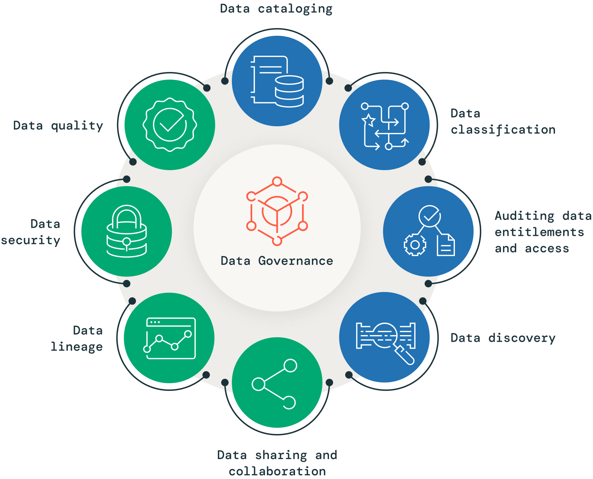
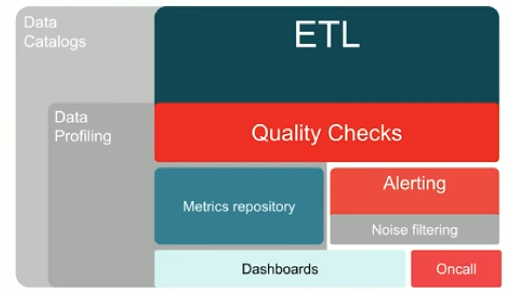

### What is data governance?

Data governance is a comprehensive approach that comprises the principles, practices and tools to manage an organization’s data assets throughout their lifecycle. By aligning data-related requirements with business strategy, data governance provides superior data management, quality, visibility, security and compliance capabilities across the organization. Implementing an effective data governance strategy allows companies to make data easily available for data-driven decision-making while safeguarding their data from unauthorized access, and ensuring compliance with regulatory requirements.

## What are the business benefits of data governance?

Data governance is essential for unlocking the value of data, which is a critical asset for organizations. By implementing a robust data governance approach, businesses can leverage their data assets, gain a competitive edge, and earn and maintain customer trust by ensuring sound data and privacy practices.

**Increased operational efficiency and reduced costs**

Effective data governance allows organizations to create a single source of truth for their data estate, preventing data sprawl and silos, and reducing duplication. This leads to increased efficiency, reduced costs and easier management of security and governance concepts across the data estate.

**Improved productivity and faster decision-making**

Data governance promotes data democratization by ensuring data accuracy, consistency, and trustworthiness. It helps data users find high-quality data quickly, promoting a better understanding of the data’s meaning and context, leading to increased productivity and faster decision-making.

**Enhanced collaboration and value realization**

A strong data governance program lays the foundation for enhanced data collaboration and sharing across teams, business units, and partners. This helps organizations promote knowledge sharing and build a better data culture, leading to increased innovation, better decision-making, and maximizing the value of their data.

**Enhanced security and privacy**

Data governance mitigates security and privacy risks by implementing controls and processes to prevent unauthorized access and misuse of sensitive data. It promotes a culture of trust and transparency with stakeholders.

**Better compliance with regulations and standards**

Effective data governance results in better compliance with regulatory requirements, such as HIPAA, FedRAMP, GDPR or CCPA. This protects the organization’s reputation, avoids potential financial and legal consequences, and increases stakeholder trust.

## Key elements of data governance

### Data cataloging

Effective data governance requires knowledge of the data that exists within an organization. This is where a data catalog comes in, as it provides a centralized metadata repository for an organization’s data assets. A data catalog allows stakeholders to quickly discover, understand and access the data they need, improving data-related activities such as discovery, governance and analytics. It acts as a searchable index of all the data available, including information about its format, structure, location and usage, providing semantic value to an otherwise unidentifiable sea of information. Incorporating a data catalog into a governance program can help organizations improve their data management, enhance collaboration, reduce redundancy and ensure proper access controls and audit information retrieval.

### Data quality

In today’s data-driven world, ensuring high data quality is crucial for accurate analytics, informed decision-making and cost-effectiveness. Data quality directly impacts the reliability of data-driven decisions and is a key aspect of data governance. To maintain effective data governance, organizations must prioritize the evaluation of key data quality attributes such as accuracy, completeness, freshness and compliance with data-quality rules. Therefore, a strong focus on data quality is essential in any data governance strategy, as it helps trace data lineage, enforce data quality rules, and track changes. Don’t let poor data quality compromise your business decisions and resource allocation — prioritize data quality as a critical part of your data governance efforts for better outcomes.

### Data classification 

Data classification is a crucial part of data governance that involves organizing and categorizing data based on its sensitivity, value and criticality. With the exponential growth of data, businesses are increasingly concerned about protecting sensitive data, mitigating risks and ensuring data quality. Classification allows organizations to identify and classify data based on its risk level and importance, allowing them to apply appropriate security measures and policies. A robust data classification system enhances data governance, reduces risks and ensures data quality and protection at scale.

### Data security

Organizations understand the significance of granting high-quality data access to their teams to drive insights and business value, while prioritizing sensitive data protection against unauthorized access. Effective data access management is crucial for data security and governance, and a good data security governance program should include access controls that define which groups or individuals can access what data. These controls can be highly specific, down to the individual record or file. As data breaches and regulations such as GDPR and CCPA pose increased risks, businesses must establish clear governance policies that define who can access sensitive data sets and how to track any misuse. Unauthorized access to private or sensitive information should not occur, and implementing effective access management strategies is essential to safeguard data and maintain customer trust.

### Auditing data entitlements and access

Effective data access auditing is a critical aspect of data governance and security governance programs, particularly in regulated industries. By understanding who has access to what data and tracking recent access, organizations can proactively identify overentitled users or groups and adjust their access accordingly, minimizing the risk of data misuse. Without proper audit mechanisms in place, an organization may not be fully aware of their risk surface area, leaving them vulnerable to data breaches and regulatory noncompliance. Therefore, a well-designed audit team within a data governance or security governance organization plays a key role in ensuring data security and compliance with regulations such as GDPR and CCPA. By implementing effective data access auditing strategies, organizations can maintain the trust of their customers and protect their data from unauthorized access or misuse.

### Data lineage

Data lineage is a powerful tool that helps organizations ensure data quality and trustworthiness by providing a better understanding of data sources and consumption. It captures relevant metadata and events throughout the data’s lifecycle, providing an end-to-end view of how data flows across an organization’s data estate. As an essential pillar of a pragmatic data governance strategy, data lineage enables organizations to become compliant and audit-ready while reducing the operational overhead of creating audit trails manually, and providing trusted sources for audit reports. Additionally, data lineage empowers data consumers to perform better analyses, and helps data teams perform root cause analysis of any errors, significantly reducing debugging time.

### Data discovery

As organizations continue to gather massive amounts of data from various sources, it’s becoming increasingly important to make this data easily discoverable for analytics, AI or ML use cases. This is critical to accelerate data democratization and unlock the true value of the data. Furthermore, with the emergence of modern data assets like dashboards, machine learning models, queries, libraries and notebooks, data discovery has become a key pillar of a robust data governance strategy. Organizations should view data discovery as a fundamental aspect of their data governance strategy. It enables data teams to easily locate data assets across the organization, collaborate on various projects, and innovate quickly and efficiently. This helps to prevent data duplication, which can be problematic as it costs money to persist them, and may lead to governance challenges at different security levels.

### Data sharing and collaboration 

Data sharing and collaboration are vital components in today’s business environment, with organizations exchanging data with internal teams, external partners, and customers across multiple clouds, data platforms and regions. As the demand for external data continues to grow, it is critical for organizations to securely exchange data while maintaining control and visibility over how their sensitive information is used. Data cleanrooms play a critical role in secure and controlled data collaboration, ensuring that data privacy regulations are upheld. It is essential for organizations to invest in open format, interoperable and multicloud data sharing technologies to meet their data-driven innovation needs. Moreover, data marketplaces serve as a bridge between data providers and consumers, facilitating the discovery and distribution of data sets. Therefore, it is crucial to recast data sharing as a business necessity and a crucial pillar of a robust data governance strategy.

## What does a good data governance solution look like?

Data-forward organizations prioritize data, analytics and AI to drive business outcomes, and build their data strategies around a data lakehouse architecture, which unifies data, analytics and AI on a single platform. This architecture combines the best features of data warehouses and data lakes to handle all data, analytics and AI use cases. All data is stored in a cloud data lake and managed by a unified layer, allowing analytics to be performed directly on a single copy of the data. This approach simplifies data governance and security, reduces functional silos and makes collaboration easier. By instilling high trust in data, organizations can operate with confidence and better understand how data is acquired, changed, used and impacted across every analytics workload.

A data governance solution for a data lakehouse provides a number of key capabilities:

-   **Centralized data catalog:** A centralized data catalog stores all your data, ML models and analytics artifacts as well as metadata for each object. The unified catalog also blends in data from other catalogs such as an existing Hive metastore.
-   **Unified data access controls:** A single and unified permissions model across all assets and all clouds. This includes attribute-based access control (ABAC) for personally identifiable information (PII).
-   **Data auditing:** Data access is centrally audited with alerts and monitoring capabilities to promote accountability and security
-   **Data quality management:** Robust data quality management with built-in quality controls, testing, monitoring and enforcement to ensure accurate and useful data is available
-   **Data lineage:** Data lineage to get end-to-end visibility into how data flows in the lakehouse, from source to consumption, down to the column level
-   **Data discovery:** Easy data discovery to enable data scientists, analysts, engineers and stakeholders to quickly discover and reference relevant data and accelerate time to value
-   **Data sharing and collaboration:** Data can be shared — with fine-grained access controls — across clouds, regions and platforms, preventing silos from forming
-   **Data cleanrooms for privacy-safe collaboration:** Collaborate on sensitive data with internal or external stakeholders in a privacy preserving environment
-   **Open marketplace for data, analytics and AI:** Discover, access and deploy data sets, as well as AI and analytical assets — such as ML models, notebooks, applications and dashboards — without proprietary platform dependencies, complicated ETL or expensive replication.

## Who oversees data governance?

### Chief Data Officer

Your Chief Data Officer (CDO) is the most senior executive on your governance team. Ultimately, they’re responsible for your data’s security, accessibility and usability.

A CDO’s role involves setting the system up, securing funding and staff for its operation (and for related aspects like tools to automate some processes), and performing regular checks on its overall status.

### Data owners

Data owners are individuals or teams responsible for the technical administration of your data sets. They might make decisions on which team members should have access to which kinds of information. If their policies (or lack thereof) lead to a data breach, they could be held accountable.

To fulfill this role and its many responsibilities, data owners are typically also senior members of your organization.

### Data stewards

To assist in the day-to-day running of your data governance workflows, data owners and CDOs will appoint data stewards. Data stewardship essentially involves implementing the program that has been set out for them, and ensuring both old and new data is managed appropriately. They’re responsible for monitoring compliance from both employees and customers, and escalating issues if they arise.

### Data governance committees

This committee will be the main body that creates relevant policies in your organization.

Often, it will consist of senior executives and data owners, who have a keen interest in the security and usability of data. Once their policies have been approved, they may set out procedures for stewards to follow, and also resolve disputes between parties.

## What is the difference between data management and data governance?

Effective data management and data governance are crucial for any organization that handles data. Despite the frequent interchangeable use of these terms, they have distinct differences. Data management focuses on the technical aspects of data lifecycle management, including data ingestion, integration, organization, transformation and persistence, such as backup, retrieval and archiving. In contrast, data governance is about defining organizational policies, frameworks and tools to ensure that data-related requirements are aligned with the business strategy. This includes data accuracy, consistency, compliance with regulations, and internal organizational policies as well as data quality, security, privacy, auditing and risk management. Furthermore, data governance involves defining data ownership, roles and responsibilities, and enforcing policies and procedures throughout the organization. As a key pillar of a long-term data strategy that leverages data as a strategic asset, data governance plays a significant role, while data management deals with the operational aspect of delivering on that strategy.

# What Is a Data Catalog? Importance, Benefits & Features

A data catalog is a repository of data assets with information about that data. It offers tools to help people find trusted data, understand it, and use it appropriately. As a metadata repository, it gives people the context they need to leverage data effectively.

Large enterprises contain vast and complex data ecosystems. A data catalog unifies these sources into a single pane of glass, eliminating data silos while enabling data users to search across these sources for relevant information. 

In the past few years, new features have arisen to help people better navigate these complex data landscapes. Automation and semantic (or plain-language) search are examples of such features. What's more, the high value of metadata has made the data catalog the de facto control center for use cases like data governance, lineage, and data quality. In addition, a data catalog provides the unified view of all enterprise data assets leaders need to promote cross-collaboration use at scale.

## The significance of data catalogs

The role of data catalogs has evolved significantly over the years. Once limited to housing data dictionaries and business glossaries, today they grown to become a unified knowledge layer that helps everyone in an organization better understand and use data. Far from static repositories, modern data catalogs actively support people and business processes to become more data-driven.

Organizations that have adopted data catalogs consistently outperform their peers who have not yet implemented one. According to the McKinsey Global Institute, data-driven companies are 23 times more likely to acquire customers, six times more likely to retain them, and 19 times more likely to be profitable. These benefits stem from their ability to leverage data more effectively, improving everything from operational efficiency to customer experience and strategic decision-making.

Still, many companies are determining what a data catalog is and why they need one. Let’s address these questions by exploring the core capabilities of a data catalog, starting with metadata management.

## What is metadata?

Fundamentally, metadata is “data about data.” Metadata helps people understand the data's content, physical structure, and purpose, making it easier to organize and describe it to others so they can use it. Metadata can be employed with various data formats, encompassing documents, images, videos, databases, and beyond.

Metadata is everywhere. Take digital photos as an example. While the actual photo might be considered the data asset, robust metadata describes it. This includes technical details about the camera model, aperture, shutter speed, date/time, filesize, and more. From a descriptive perspective, metadata may consist of captions, people, location, etc. This metadata provides additional practical details that support comprehension.

For a data asset like a photograph, metadata may include the camera, lens, size, exposure, and more.

## Data catalogs for metadata management

Data catalogs have become the gold standard for metadata management. Unlike the more limited metadata stored in BI and other data-related tools, today’s metadata is far more expansive and supports more intelligent data analysis. A data catalog primarily focuses on data assets and products, providing an inventory of available dashboards, reports, databases, files, etc. It enriches these data assets with valuable metadata to guide and inform data users.

As organizations increasingly manage data on-premise and in the cloud, having a centralized source of metadata is essential for visibility into data assets, no matter where they are stored. This visibility supports day-to-day analysis and enhances critical data management functions such as governance, quality control, and migration. In a rapidly evolving data landscape, where new technologies and concepts continually emerge, a data catalog serves as a reliable, consistent tool for managing data efficiently and ensuring organizations can derive maximum value from their data.

The data catalog unifies metadata from key assets from various sources.

Data assets are the dashboards, reports, files, and tables that data workers need to find and access. They may reside in a [data lake](https://www.alation.com/blog/data-swamp-lake-lakehouse/), warehouse, business intelligence system, master data repository, or any other shared data resource, making discovering them in an organization challenging. A data catalog connects people to the contextualized, trusted data they need by centralizing the metadata.

## Types of metadata

There are many types of metadata. Some standard metadata categories include: 

-   Descriptive 
    
-   Technical 
    
-   Governance
    
-   Operational
    

Examples of various types of metadata as they appear in the data catalog

_Descriptive metadata_ includes business titles, definitions, tags, keywords, and other details that describe a data asset, as well as the names and roles of those who have previously worked with that asset.

_Technical metadata_ details the physical structure of data assets such as databases, schemas, tables, and columns. It helps technical roles understand crucial implementation characteristics of data assets, such as data types and formats.

_Governance metadata_ focuses on data governance policies, compliance, and data quality. Examples include data quality metrics, lineage, classification, and regulations (ex. GDPR, HIPPA).

_Operational metadata_ focuses on the information about the processing and usage of the data asset, including the frequency of updates, performance metrics, and usage statistics like popularity, top users, etc.

The collection of the metadata types described above must be automated to provide active metadata for people to use and processes to consume. A critical aspect of metadata management is tracking relationships and being able to display them. In addition, the catalog must allow custom metadata to be added.

## What does a data catalog do?

A modern data catalog helps organizations centralize their data assets' metadata to provide a single pane of glass for discovering, organizing, managing, and governing those assets. It is a platform that helps people to find, understand, and trust the data they need to make important business decisions. 

The high volume, variety, veracity, and velocity of enterprise data today make manual cataloging very difficult and automation necessary. Automated discovery of data assets is essential for the initial catalog build and ongoing discovery of new assets. Using AI and machine learning (ML) for metadata collection, semantic inference, tagging, and classification is vital to getting maximum value from automation and minimizing manual effort.

At the heart of any data catalog is robust metadata management. Some of the other essential   features and functions include:

### **Data discovery and search**

Advanced search capabilities include searching by natural language (semantic), keywords, tags, and other business metadata such as domain. Natural language search capabilities are invaluable for non-technical users. The ranking of search results should consider relevance, frequency of use, and user ratings (endorsements).

### **Data lineage**

[Data lineage](https://www.alation.com/blog/what-is-data-lineage/) helps track the flow of data from its origin to its destination and includes metadata about the data assets and transformations. The visualization allows people to understand and trust the data. An example would be to map how a critical data element moves throughout an organization. Because of the extensive metadata, engineers can conduct impact analysis when planning a change and communicate to the owners of any impacted data assets.

### **Data quality**

A data catalog supports quality profiling, documenting quality rules, and displaying data quality metrics so that data consumers grasp its quality and know whether they can trust it before use.

### **AI and data governance**

Data catalogs provide the means to classify data and assign the appropriate policies to ensure its compliant use. One benefit of having AI and data governance policies in a data catalog is the ability to conduct compliance audits. While there are similarities between AI and data governance, each discipline can also have a different focus.

For example, transparency in data governance often refers to data processes and what is happening as the data flows throughout the organization, including its quality. Data quality is critical for business processes such as reports and AI models.  

For AI, transparency is about understanding how models are built, trained, and deployed. 

It is important to note that AI requires more transparency and traceability in the training datasets and the explainability of the outputs from the model.

### **Self-service analytics**

Data catalogs support self-service by providing one place where people can find, understand, trust, and use data without always relying on IT to access or understand data. The data catalog acts as an internal data marketplace where users can request and gain access to data products and data assets. Data access covers security, privacy, and compliance with sensitive data.

### **Supports collaboration**

A data catalog provides an ideal platform for collaboration around data. It facilitates ongoing conversations, where questions and answers are tied directly to the data, enabling everyone to benefit from shared knowledge. Additionally, features like reviews and ratings of data assets allow users to gauge the quality and relevance of data, helping others understand its value and usefulness more effectively.

A data catalog should provide many other capabilities, including support for [data curation](https://www.alation.com/blog/what-is-data-curation/), classification, usage tracking, and other features.

## Benefits of a data catalog

### **Improved data efficiency**

Data catalogs improve productivity by reducing people's time searching for data and granting them more time to analyze it. This reduces the likelihood of duplicating work and gives newcomers a view into the most trusted data assets and how they are most often leveraged. Moreover, a data catalog delivers helpful context via business metadata, data quality details, and collaboration features, leading to more accurate, timely insights.

### **Better data context**

Data catalogs boost data understanding with detailed information about data assets. This includes where they come from, their quality, who uses them, and how they can or should be used. This information makes it easier for users to grasp the data's meaning, importance, and suitability. As a result, users can perform better decision-making and analysis.

### **Accelerated innovation**

Data catalogs help accelerate the development of new products and services across all industries. Improved data context speeds up the discovery process and increases collaboration between teams, enabling quicker delivery. 

### **Boost data governance and compliance**

Data catalogs help centralize critical AI and data governance policies an organization uses. Having policies assigned to data assets helps users understand how to use the data compliantly. In addition, data lineage supports policy traceability and auditing, reducing risk.

## Evolution of data catalogs

Data catalogs have evolved to meet the changing needs of modern data management. Before 2000, data catalogs were manual inventories of an organization’s data. The primary contents of name, location, and description were often stored in documents or spreadsheets. Some companies referred to them as their data dictionaries.

As organizations started using databases and data warehouses, enterprise data catalogs were created to provide descriptive metadata as a guide. The early solutions were often built in-house, storing the contents in a database so the contents could be searched. In addition, data management systems (DBMS) at that time had some capabilities but focused on technical metadata and only the contents of its database.

These catalogs grew to include data assets (datasets and reports), making it easier for users to find specific data elements in these systems.

In the early 21st century, the need for thorough metadata management led to catalogs that provided information about data lineage, quality, connections, and business context. These catalogs became crucial for data governance.

Between 2000 and 2015 the age of big data gave rise to [self-service analytics](https://www.alation.com/blog/what-is-self-service-analytics/). Data catalogs evolved to handle different data sources and became vital for finding and preparing data. Business users sought self-service capabilities to avoid relying on technical data teams during this period, strengthening the need for data catalogs.

Data catalog companies would emerge to offer platforms to manage data assets, business glossaries, and data governance capabilities.

The modern data catalog era began in 2015 and continues today. Modern catalogs use [AI and ML](https://www.alation.com/blog/ai-and-ml-in-model-governance/) to automate metadata creation, accelerate curation, and enhance data discovery. Today’s data leaders use modern data catalogs to manage the ever-changing data ecosystem, including integrating into more data management processes such as data quality and data governance. 

As data technology changes and new concepts, such as the modern data stack, data fabric, and [data mesh](https://www.alation.com/blog/data-mesh-architecture/), the data catalog is the one constant part of the data ecosystem that organizations can rely on. 

In short, data catalogs have evolved from simple lists to powerful tools for efficient data management and analytics in the age of AI.

## What changes when you implement a data catalog?

A data catalog brings key improvements to data management by making metadata more accessible and useful. Its true value, though, is often most noticeable in how it enhances analysis across business, engineering, and data science activities.

We work in an age where self-service analytics is a must. IT organizations can’t provide all the data needed by the ever-increasing numbers of people who need to analyze it. But today’s analysts and data scientists are often working blind, without visibility into the data assets that exist, the contents of those data assets, or their quality and usefulness. 

They spend too much time finding and understanding data, often recreating existing data assets. They frequently work with inadequate data, resulting in incorrect analysis and model training. The illustration below shows how analysis processes change with a data catalog.

Without a catalog, analysts look for data by sorting through documentation, talking to colleagues, relying on tribal knowledge, or simply working with familiar data assets because they know about them. The process is fraught with trial and error, waste and rework, and repeated dataset searching, often leading to working with “close enough” data as time passes. 

With a data catalog, the analyst can search and find data quickly, see all available datasets, evaluate and make informed choices for which data to use, and perform data preparation and analysis efficiently and confidently. It is common to experience a shift from 80% of time spent finding data and only 20% on analysis to 20% finding and preparing data with 80% for analysis. The quality of analysis is substantially improved, and the capacity of organizational analysis increases without adding more people.

## User adoption strategies for a data catalog

To make the most of a data catalog and ensure it becomes an integral part of your data-driven journey, users can adopt a data catalog effectively through these strategies:

### **User training and onboarding**

Launch thorough training and onboarding programs to teach users how to use the data catalog effectively. Offer workshops, tutorials, videos, and documentation to help users learn the way they like to. Keep the onboarding information content or links to the content in the catalog for easy access.

### **Encourage collaboration**

Foster teamwork in the organization. Urge users to comment on data assets, share ideas, and work together on data projects using the catalog. Recognize and reward contributors and highlight team achievements. Consider hosting "curation power-hour" events where teams can share their knowledge, making the platform better for everyone. This builds a sense of community and shared data knowledge.

### **Highlight real-world use cases**

Highlight real-life examples of how the data catalog has made a big difference in finding, preparing, and analyzing data. Share success stories and how the catalog helps various teams and projects. This shows how useful it is and encourages more people to use it.

These strategies help users welcome the data catalog as a valuable tool for their data tasks and encourage its effective use across the organization.

## Conclusion

A data catalog allows organizations to utilize their data more effectively. By automating and organizing metadata, improving data discoverability, sharing data knowledge, and supporting AI and data governance efforts, a data catalog helps organizations become more data-driven, efficient, and compliant with the use of data.

With Alation, your organization can experience all the benefits described in this blog. In addition, our catalog is built for everyone, enabling all to share and use data knowledge. People see data in a new light when it comes from a single pane of glass. There is increased trust and confidence in the data reflected in the company's culture.

# Understanding the Essence of a Data Catalog

A Data Catalog serves as the backbone of effective data management within an organization. Its core purpose lies in providing a unified and organized view of the vast and intricate landscape of data assets. Here are the key components that constitute the essence of a data catalog:

**1\. Centralized Data Inventory**: At its core, a data catalog acts as a centralized inventory for all data-related assets within an organization. This includes databases, tables, files, metadata, data pipelines, and more. By collating this information in one accessible location, a data catalog eliminates data silos, allowing teams to view the entirety of available data resources.

**2\. Metadata Enrichment**: Metadata, or data about data, forms a fundamental part of a data catalog. It includes information such as data lineage (the path data takes from source to destination), data quality, data ownership, and usage statistics. This metadata enrichment provides context to the raw data, making it comprehensible and usable for different teams.

**3\. Efficient Data Discovery**: A significant challenge in the data-driven landscape is the ability to quickly find relevant data. Data catalogs address this challenge by offering robust search and filtering functionalities. Team members can input specific queries or parameters, and the catalog will swiftly retrieve relevant datasets. This enhances efficiency by reducing the time spent searching for data, allowing teams to focus on analysis and decision-making.

**4\. Data Collaboration and Knowledge Sharing**: Collaboration is key to innovation. Data catalogs facilitate collaboration by enabling team members to annotate, comment, and share insights about specific datasets. This interactive feature fosters knowledge sharing among team members, ensuring that the collective intelligence of the organization is leveraged to its full potential. Collaboration tools within the catalog encourage discussions, problem-solving, and the sharing of best practices among data professionals.

**5\. Data Governance and Security**: Data governance, including security and compliance, is paramount for any organization dealing with sensitive data. Data catalogs play a pivotal role in ensuring data governance by defining access permissions, tracking data usage, and highlighting sensitive data elements. This helps organizations adhere to regulatory requirements and maintain data integrity and confidentiality.

**6\. Scalability and Adaptability**: As organizations grow, so does their data. A robust data catalog is designed to scale with the organization. Whether handling terabytes or petabytes of data, a well-implemented data catalog can adapt to changing data volumes and types. It accommodates new data sources and technologies, ensuring that the organization remains agile and competitive in the face of evolving data challenges.

# Value Proposition for Different Teams

Data catalogs play a pivotal role in empowering various teams within an organization. Here’s a detailed look at how different teams benefit from the implementation of data catalogs:

**Data Scientists and Analysts**

1.  **Efficient Data Discovery**: Data scientists and analysts can swiftly discover relevant datasets using the search and filtering functionalities of data catalogs. This efficiency saves them substantial time that would otherwise be spent on manually searching for data, allowing them to focus on advanced analytics and insights generation.
2.  **Data Lineage and Understanding**: Data catalogs provide valuable metadata, including data lineage and transformation processes. Data scientists can understand the origin and evolution of data, ensuring the accuracy and reliability of their analyses. This understanding is crucial for building trustworthy models and making data-driven recommendations.
3.  **Collaboration and Knowledge Sharing**: Data catalogs facilitate collaboration by allowing data scientists to annotate and comment on datasets. They can share domain knowledge, assumptions, and insights with their peers, fostering a culture of collaboration and collective learning within the team.

**IT and Data Engineers**

1.  **Optimized Data Management**: IT and data engineering teams can optimize data pipelines and workflows by comprehending the dependencies between different datasets. Understanding these dependencies is essential for efficient data processing, data integration, and ensuring data consistency across various systems and applications.
2.  **Data Governance and Security**: Data catalogs support data governance efforts by providing a clear view of data access policies and permissions. IT teams can enforce security protocols, ensuring that sensitive data is accessed only by authorized personnel. This is critical for regulatory compliance and safeguarding the organization’s data assets.
3.  **Troubleshooting and Issue Resolution**: In the event of data issues or discrepancies, data engineers can trace back to the source using data catalogs. This capability simplifies troubleshooting, accelerates issue resolution, and minimizes downtime in data pipelines and applications.

**Business and Strategy Teams**

1.  **Data-Driven Decision-Making**: Business and strategy teams leverage data catalogs to access accurate and up-to-date information. With reliable data at their fingertips, they can make informed decisions, devise effective strategies, and identify emerging market trends. Data-driven decision-making enhances the organization’s agility and competitiveness.
2.  **Performance Monitoring and KPIs**: Business teams use data catalogs to monitor key performance indicators (KPIs) and track business metrics. By visualizing relevant data in real-time, they can assess the impact of their strategies and initiatives. Data catalogs enable business teams to identify areas of improvement promptly and capitalize on successful endeavors.
3.  **Customer Insights and Personalization**: By analyzing customer data available in the data catalog, business teams gain valuable insights into customer behavior, preferences, and demographics. This information is instrumental in personalizing marketing campaigns, tailoring product offerings, and enhancing customer experiences. Personalized interactions foster customer loyalty and drive revenue growth.

By catering to the unique needs of data scientists, IT and data engineering teams, as well as business and strategy teams, data catalogs serve as a unifying force within an organization. They bridge the gap between technical complexities and business objectives, ensuring that data becomes a strategic asset that fuels innovation, fosters collaboration, and propels the organization toward sustainable growth.

# Real-World Examples of Companies Utilizing Data Catalogs

Numerous forward-thinking companies have embraced data catalogs to harness the power of their data assets efficiently. Let’s explore a few examples to understand how these organizations have leveraged data catalogs to enhance their operations and decision-making processes:

**1\. Netflix**: As a leading entertainment streaming service, Netflix relies heavily on data to personalize user experience and recommend content. They use data catalogs to manage vast amounts of viewer data, enabling their data scientists to analyze viewer preferences and behavior. By organizing their data assets effectively, Netflix ensures that content recommendations are accurate, keeping their subscribers engaged and satisfied.

**2\. Airbnb**: Airbnb, the popular online marketplace for lodging and travel experiences, handles a vast amount of data related to property listings, user preferences, and booking patterns. With a data catalog in place, Airbnb can optimize its search algorithms, ensuring users find accommodations that match their preferences seamlessly. Data catalogs help Airbnb’s teams collaborate efficiently, ensuring a seamless experience for both hosts and guests.

**3\. Intuit**: Intuit, the company behind financial software products like QuickBooks and TurboTax, relies on data catalogs to manage financial data and customer information securely. By using data catalogs, Intuit ensures data accuracy, enabling small businesses and individuals to manage their finances effectively. The catalog facilitates collaboration among Intuit’s development and data science teams, enhancing the functionality and reliability of their software products.

**4\. Lyft**: Ride-sharing giant Lyft utilizes data catalogs to manage diverse sets of data, including user information, ride history, and traffic patterns. By understanding these data points comprehensively, Lyft optimizes its ride algorithms, ensuring efficient routes, accurate fare calculations, and timely pickups. Data catalogs enable Lyft’s data engineers and analysts to work cohesively, leading to improved user experiences and operational efficiency.

**5\. Walmart**: Walmart, one of the world’s largest retail chains, relies on data catalogs to manage inventory, track customer preferences, and optimize supply chain operations. By organizing and analyzing data effectively, Walmart ensures that its stores are well-stocked with the products customers want, reducing waste and improving customer satisfaction. Data catalogs play a vital role in Walmart’s data-driven decision-making processes, helping them adapt to changing market demands swiftly.

# Data Catalogs Across Diverse Industry Verticals

Data catalogs have become indispensable tools across a wide array of industry verticals, each with its unique data challenges and opportunities. Let’s explore how companies in sectors like banking, insurance, financial markets, retail, and healthcare have embraced data catalogs to transform their operations and gain a competitive edge:

**1\. Banking and Financial Services:**

**JPMorgan Chase & Co.**: JPMorgan Chase, one of the world’s largest financial institutions, utilizes data catalogs to manage vast amounts of financial data, customer information, and market trends. By centralizing their data assets, JPMorgan Chase enhances risk management, fraud detection, and customer service. Data catalogs enable their analysts to quickly access relevant data, ensuring timely and informed decision-making in the ever-changing financial landscape.

**2\. Insurance**

**Allstate Insurance**: Allstate, a leading insurance provider, employs data catalogs to streamline their claims processing, underwriting, and customer service operations. By organizing customer data and policy information, Allstate enhances customer interactions, tailoring insurance offerings to individual needs. Data catalogs empower their teams to assess risk accurately, price policies competitively, and improve customer satisfaction through personalized services.

**3\. Financial Markets**

**NASDAQ:** NASDAQ, a prominent stock exchange, relies on data catalogs to manage trading data, market trends, and investor behavior. By consolidating and analyzing vast datasets, NASDAQ enhances its trading platforms, ensuring smooth and efficient transactions for investors worldwide. Data catalogs enable NASDAQ to monitor market volatility, optimize trading algorithms, and provide real-time insights to traders, contributing to a dynamic and responsive financial ecosystem.

**4\. Retail**

**Amazon**: Amazon, the global e-commerce giant, employs data catalogs to manage product information, customer preferences, and supply chain data. By leveraging data catalogs, Amazon optimizes its inventory management, ensuring products are available when and where customers need them. Data catalogs enable Amazon’s teams to analyze customer buying patterns, personalize product recommendations, and enhance the overall shopping experience, driving customer loyalty and revenue growth.

**5\. Healthcare**

**Mayo Clinic**: Mayo Clinic, a renowned healthcare provider, utilizes data catalogs to manage patient records, medical research data, and treatment protocols. By organizing and securing sensitive patient data, Mayo Clinic enhances patient care, accelerates medical research, and ensures compliance with healthcare regulations. Data catalogs enable healthcare professionals to access relevant patient information swiftly, leading to more accurate diagnoses, personalized treatment plans, and improved patient outcomes.

# Leading Data Catalog Players

The landscape of data catalog products has been evolving rapidly, with several key players dominating the market. Please note that there might have been new entrants or changes in the market since my last update. However, as of 2022, some of the key players in the data catalog products industry include:

1.  [**Alation**](https://www.alation.com/): Alation offers a data catalog platform that focuses on improving data discovery, understanding, and collaboration. It provides a comprehensive solution for data governance, data search, and data collaboration.
2.  [**Collibra**](https://www.collibra.com/us/en): Collibra is a widely recognized data governance and cataloging platform. It not only offers data cataloging features but also provides data governance, stewardship, and data management capabilities.
3.  [**Informatica**](https://www.informatica.com/): Informatica offers a robust data catalog and data governance solution. Their platform provides metadata management, data discovery, and data lineage features to help organizations manage their data assets effectively.
4.  [**AWS Glue DataBrew**](https://docs.aws.amazon.com/glue/latest/dg/components-overview.html#data-catalog-intro): Amazon Web Services (AWS) offers Glue DataBrew, a visual data preparation tool that includes data cataloging features. It allows users to discover, clean, and transform data for analytics and machine learning.
5.  [**Google Cloud Data Catalog**](https://cloud.google.com/dataplex/docs/introduction): Google Cloud offers Data Catalog, a fully managed and scalable metadata management service. It helps organizations discover, understand, and manage their data assets across various Google Cloud services.
6.  [**IBM Watson Knowledge Catalog**](https://www.ibm.com/products/knowledge-catalog): IBM’s Watson Knowledge Catalog provides a collaborative environment for data scientists, engineers, and business users. It includes features for data discovery, data governance, and data collaboration.
7.  [**Microsoft Azure Purview**](https://azure.microsoft.com/en-us/products/purview): Azure Purview is a unified data governance service offered by Microsoft Azure. It provides a holistic approach to discovering, understanding, and managing data assets across on-premises, multi-cloud, and SaaS environments.

Remember that the best data catalog product for a specific organization depends on its unique requirements, including the scale of operations, budget constraints, and specific use cases. Before choosing a data catalog solution, it’s essential to assess the features, compatibility, and support services offered by these key players to find the most suitable option for your organization’s needs.

