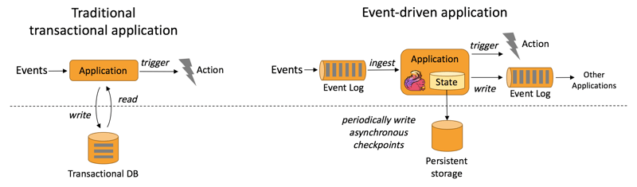

# Getting started with Apache Flink: A guide to stream processing

## TOC

- Introduction to Apache Flink and stream processing
- Setting up a Flink development environment
- A simple Flink application walkthrough: data ingestion, processing, and output
- Understanding Flink’s key concepts (DataStream API, windows, transformations, sinks, sources)
- Basic troubleshooting and monitoring for Flink applications
- Testing
- Conclusion

## Introduction to Apache Flink and Stream Processing

[Apache Flink](https://flink.apache.org/) is an open-source, high-performance framework designed for large-scale data processing, excelling at real-time stream processing. It features low-latency and stateful computations, enabling users to process live data and generate insights on-the-fly. Flink is fault-tolerant, scalable, and provides powerful data processing capabilities that cater to various use cases.

Stream processing, on the other hand, is a computing paradigm that allows **real-time data processing** as soon as it arrives or is produced. Unlike traditional batch processing systems that deal with data at rest, stream processing handles data in motion. This paradigm is especially useful in scenarios where insights need to be derived immediately, such as real-time analytics, fraud detection, and event-driven systems. Flink's powerful stream-processing capabilities and its high-throughput, low-latency, and exactly-once processing semantics make it an excellent choice for such applications.

## Setting up a Flink development environment

Setting up a development environment for Apache Flink is a straightforward process. Here's a brief step-by-step guide:

-   _Install Java_: Flink requires Java 8 or 11, so you need to have one of these versions installed on your machine. You can download Java from the [Oracle](https://www.oracle.com/in/java/technologies/downloads/) website or use OpenJDK.
-   _Download and Install Apache Flink_: You can download the latest [binary of Apache Flink](https://flink.apache.org/downloads/) from the official Flink website. Once downloaded, extract the files to a location of your choice.
-   _Start a Local Flink Cluster_: Navigate to the Flink directory in a terminal, then go to the **'bin'** folder. Start a local Flink cluster using the command **./start-cluster.sh** (for Unix/Linux/macOS) or **start-cluster.bat** (for Windows).
-   _Check Flink Dashboard_: Open a web browser and visit [http://localhost:8081](http://localhost:8081/), you should see the Flink Dashboard, indicating that your local Flink cluster is running successfully.
-   _Set up an Integrated Development Environment (IDE)_: For writing and testing your Flink programs, you can use an IDE such as **IntelliJ IDEA** or Eclipse. Make sure to also install the Flink plugin if your IDE has one.
-   _Create a Flink Project_: You can create a new Flink project (Refer - [Apache Flink Playground](https://github.com/apache/flink-playgrounds)) using a build tool like Maven or Gradle. Flink provides quickstart Maven archetypes to set up a new project easily.

Once you've set up your Flink development environment, you're ready to start developing Flink applications. Remember that while this guide describes a basic local setup, a production Flink setup would involve a distributed cluster and possibly integration with other big data tools.

## A simple Flink application walkthrough: Data ingestion, Processing and Output

A simple Apache Flink application can be designed to consume a data stream, process it, and then output the results. Let's walk through a basic example:

-   _Data Ingestion (Sources)_: Flink applications begin with one or more data sources. A source could be a file on a filesystem, a Kafka topic, or any other data stream.
-   _Data Processing (Transformations)_: Once the data is ingested, the next step is to process or transform it. This could involve filtering data, aggregating it, or applying any computation.
-   _Data Output (Sinks)_: The final step in a Flink application is to output the processed data, also known as a sink. This could be a file, a database, or a Kafka topic.
-   _Job Execution_: After defining the sources, transformations, and sinks, the Flink job needs to be executed.

Here's a complete example that reads data from a Kafka topic, performs some basic word count processing on the stream, and then writes the results into a Cassandra table. This example uses Java and Flink's DataStream API.

    
    
    import org.apache.flink.api.common.functions.FlatMapFunction;
    import org.apache.flink.api.java.tuple.Tuple2;
    import org.apache.flink.streaming.api.datastream.DataStream;
    import org.apache.flink.streaming.api.environment.StreamExecutionEnvironment;
    import org.apache.flink.streaming.connectors.cassandra.CassandraSink;
    import org.apache.flink.streaming.connectors.kafka.FlinkKafkaConsumer;
    import org.apache.flink.util.Collector;
    import org.apache.kafka.common.serialization.SimpleStringSchema;
    
    import java.util.Properties;
    
    public class KafkaToCassandraExample {
    
        public static void main(String[] args) throws Exception {
    
            final StreamExecutionEnvironment env =
    StreamExecutionEnvironment.getExecutionEnvironment();
    
            Properties properties = new Properties();
            properties.setProperty("bootstrap.servers", "localhost:9092"); // address of your
    Kafka server
            properties.setProperty("group.id", "test"); // specify your Kafka consumer group
    
            DataStream<String> stream = env.addSource(new FlinkKafkaConsumer<>("topic", new
    SimpleStringSchema(), properties));
    
            DataStream<Tuple2<String, Integer>> processedStream = stream
                    .flatMap(new Tokenizer())
                    .keyBy(0)
                    .sum(1);
    
            CassandraSink.addSink(processedStream)
                    .setQuery("INSERT INTO wordcount.word_count (word, count) values (?, ?);")
                    .setHost("127.0.0.1") // address of your Cassandra server
                    .build();
    
            env.execute("Kafka to Cassandra Word Count Example");
        }
    
        public static final class Tokenizer implements FlatMapFunction<String, Tuple2<String,
    Integer>> {
            @Override
            public void flatMap(String value, Collector<Tuple2<String, Integer>> out) {
                // normalize and split the line into words
                String[] words = value.toLowerCase().split("\\W+");
    
                // emit the words
                for (String word : words) {
                    if (word.length() > 0) {
                        out.collect(new Tuple2<>(word, 1));
                    }
                }
            }
        }
    }
    

## Understanding Flink’s key concepts

-   [DataStream API](https://nightlies.apache.org/flink/flink-docs-release-1.17/docs/dev/datastream/overview/): Flink's main tool for creating stream processing applications, providing operations to transform data streams.
-   [Windows](https://nightlies.apache.org/flink/flink-docs-master/docs/dev/datastream/operators/windows/): Defines a finite set of stream events for computations, based on count, time, or sessions.
-   [Transformations](https://nightlies.apache.org/flink/flink-docs-master/docs/dev/dataset/transformations/): Operations applied to data streams to produce new streams, including map, filter, flatMap, keyBy, reduce, aggregate, and window.
-   [Sinks](https://nightlies.apache.org/flink/flink-docs-release-1.13/docs/connectors/datastream/overview/): The endpoints of Flink applications where processed data ends up, such as a file, database, or message queue.
-   [Sources](https://nightlies.apache.org/flink/flink-docs-release-1.13/docs/connectors/datastream/overview/): The starting points of Flink applications that ingest data from external systems or generate data internally, such as a file or Kafka topic.
-   [Event Time vs. Processing Time](https://nightlies.apache.org/flink/flink-docs-master/docs/concepts/time/): Flink supports different notions of time in stream processing. Event time is the time when an event occurred, while processing time is the time when the event is processed by the system. Flink excels at event time processing, which is crucial for correct results in many scenarios.
-   [CEP (Complex Event Processing)](https://nightlies.apache.org/flink/flink-docs-master/docs/libs/cep/#:~:text=FlinkCEP%20is%20the%20Complex%20Event,what's%20important%20in%20your%20data.): Flink supports CEP, which is the ability to detect patterns and complex conditions across multiple streams of events.
-   [Table API & SQL](https://nightlies.apache.org/flink/flink-docs-master/docs/dev/table/overview/): Flink offers a Table API and SQL interface for batch and stream processing. This allows users to write complex data processing applications using a SQL-like expression language.
-   [Stateful Functions (StateFun)](https://nightlies.apache.org/flink/flink-statefun-docs-master/): StateFun is a framework by Apache Flink designed to build distributed, stateful applications. It provides a way to define, manage, and interact with a dynamically evolving distributed state of functions.
-   [Operator Chain and Task](https://nightlies.apache.org/flink/flink-docs-release-1.13/docs/concepts/flink-architecture/): Flink operators (transformations) can be chained together into a task for efficient execution. This reduces the overhead of thread-to-thread handover and buffering.
-   [Savepoints](https://nightlies.apache.org/flink/flink-docs-master/docs/ops/state/savepoints/): Savepoints are similar to checkpoints, but they are triggered manually and provide a way to version and manage the state of Flink applications. They are used for planned maintenance and application upgrades.
-   [State Management](https://nightlies.apache.org/flink/flink-docs-master/docs/dev/datastream/fault-tolerance/state/): Flink provides fault-tolerant state management, meaning it can keep track of the state of an application (e.g., the last processed event) and recover it if a failure occurs.
-   [Watermarks](https://nightlies.apache.org/flink/flink-docs-master/docs/dev/datastream/event-time/generating_watermarks/): These are a mechanism to denote progress in event time. Flink uses watermarks to handle late events in stream processing, ensuring the system can handle out-of-order events and provide accurate results.
-   [Checkpoints](https://nightlies.apache.org/flink/flink-docs-master/docs/ops/state/checkpoints/): Checkpoints are a snapshot of the state of a Flink application at a particular point in time. They provide fault tolerance by allowing an application to revert to a previous state in case of failures.

## Basic troubleshooting and monitoring in Flink

Troubleshooting and monitoring are essential aspects of running Apache Flink applications. Here are some key concepts and tools:

-   [Flink Dashboard](https://docs.cloudera.com/csa/1.2.0/monitoring/topics/csa-hs-webui.html): This web-based user interface provides an overview of your running applications, including statistics on throughput, latency, and CPU/memory usage. It also allows you to drill down into individual tasks to identify bottlenecks or issues.
-   [Logging](https://nightlies.apache.org/flink/flink-docs-release-1.17/docs/deployment/advanced/logging/): Flink uses SLF4J for logging. Logs can be crucial for diagnosing problems or understanding the behavior of your applications. Log files can be found in the log directory in your Flink installation.
-   [Metrics](https://nightlies.apache.org/flink/flink-docs-master/docs/ops/metrics/): Flink exposes a wide array of system and job-specific metrics, such as the number of elements processed, bytes read/written, task/operator/JobManager/TaskManager statistics, and more. These metrics can be integrated with external systems like Prometheus or Grafana.
-   [Exceptions](https://catalog.us-east-1.prod.workshops.aws/workshops/429cec9e-3222-4943-82f7-1f45c45ed99a/en-US/2-flinkdashboard/job-level-insights): If your application fails to run, Flink will throw an exception with a stack trace, which can provide valuable information about the cause of the error. Reviewing these exceptions can be a key part of troubleshooting.
-   [Savepoints/Checkpoints](https://catalog.us-east-1.prod.workshops.aws/workshops/429cec9e-3222-4943-82f7-1f45c45ed99a/en-US/2-flinkdashboard/job-level-insights): These provide a mechanism to recover your application from failures. If your application isn't recovering correctly, it's worth investigating whether savepoints/checkpoints are being made correctly and can be successfully restored.
-   [Backpressure](https://nightlies.apache.org/flink/flink-docs-master/docs/ops/monitoring/back_pressure/): If a part of your data flow cannot process events as fast as they arrive, it can cause backpressure, which can slow down the entire application. The Flink dashboard provides a way to monitor this.
-   _Network Metrics_: Flink provides metrics on network usage, including buffer usage and backpressure indicators. These can be useful for diagnosing network-related issues.

Remember, monitoring and troubleshooting are iterative processes. If you notice performance degradation or failures, use these tools and techniques to investigate, identify the root cause, and apply a fix. Then monitor the system again to ensure that the problem has been resolved.

## Conclusion

In conclusion, Apache Flink is a robust and versatile open-source stream processing framework that enables fast, reliable, and sophisticated processing of large-scale data streams. Starting with a simple environment setup, we've walked through creating a basic Flink application that ingests, processes, and outputs data. We've also touched on the foundational concepts of Flink, such as the DataStream API, windows, transformations, sinks, and sources, all of which serve as building blocks for more complex applications.

In episode 4 of Apache Flink series, we'll see how to consume data from kafka in real time and process it with Mage.